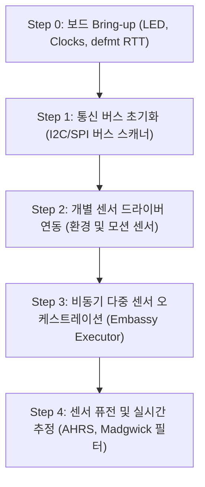

# NUCLEO-H743ZI2 Rust 임베디드 펌웨어 프로젝트

본 저장소는 STMicroelectronics의 **NUCLEO-H743ZI2** 개발 보드와 **X-NUCLEO-IKS01A3** 모션 MEMS 및 환경 센서 확장 보드를 기반으로, 현대적인 Rust 임베디드 생태계(`no_std`, `embassy`, `embedded-hal`)를 활용한 고성능 센서 제어 및 펌웨어 예제를 체계적으로 개발하고 검증하는 프로젝트이다.

---

## 1. 대상 하드웨어 구성 (Target Hardware)

### ① 메인보드: NUCLEO-H743ZI2
- **MCU**: STM32H743ZI (Arm® 32-bit Cortex®-M7 with double-precision FPU, L1 캐시, 최대 480 MHz 동작)
- **메모리**: 2 MB Dual-Bank Flash, 1 MB RAM (TCM RAM, AXI SRAM, SRAM1~4, Backup SRAM 분할 구조)
- **온보드 디버거**: ST-LINK/V3E (SWD/JTAG 디버깅, 가상 COM 포트, RTT 통신 지원)
- **사용자 I/O**: 사용자 LED 3개 (Green, Blue, Red), 사용자 푸시 버튼 1개, Reset 버튼 1개
- **커넥터**: ST Zio 확장 커넥터(Arduino Uno V3 호환) 및 ST morpho 헤더

### ② 센서 쉴드: X-NUCLEO-IKS01A3
Arduino Uno V3 핀 호환 규격으로 NUCLEO-H743ZI2 상단에 직접 적층 결합(Stackable)되는 모션 MEMS 및 환경 센서 확장 보드이다.

| 센서 칩셋 | 분류 | 주요 측정 항목 및 사양 | 통신 인터페이스 |
| :--- | :--- | :--- | :--- |
| **LSM6DSO** | 6축 IMU | 3축 가속도계(±2/±4/±8/±16 g) + 3축 자이로스코프(±125/±250/±500/±1000/±2000 dps), 온칩 머신러닝 코어(MLC) | I2C (기본) / SPI |
| **LIS2MDL** | 지자기 센서 | 3축 디지털 자기 센서(±50 gauss), 초저전력 동작 | I2C (기본) / SPI |
| **LIS2DW12** | 가속도계 | 3축 초저전력 고성능 선형 가속도계(±2/±4/±8/±16 g) | I2C (기본) / SPI |
| **LPS22HH** | 기압 센서 | 260~1260 hPa 고정밀 대기압 및 온도 측정 | I2C (기본) / SPI |
| **HTS221** | 온습도 센서 | 정전용량식 상대 습도(0~100% rH) 및 온도(-40~120 °C) 측정 | I2C |
| **STTS751** | 온도 센서 | 고정밀 저전력 디지털 온도 센서(±0.5 °C 정확도, -40~125 °C) | I2C (SMBus 호환) |
| **DIL 24-pin** | 확장 소켓 | 추가 MEMS 어댑터(STEVAL-MKIxxxV 시리즈 등) 장착용 소켓 | I2C / SPI / GPIO |

---

## 2. 소프트웨어 아키텍처 및 기술 스택 (Software Stack)

- **언어 및 런타임**: Rust (`no_std`), Target: `thumbv7em-none-eabihf` (Cortex-M7 with Hardfloat)
- **임베디드 비동기 프레임워크**: `embassy` (`embassy-stm32`, `embassy-executor`, `embassy-time`, `embassy-sync`)
- **하드웨어 추상화 계층 (HAL)**: `embedded-hal` / `embedded-hal-async`
- **로깅 및 진단 프레임워크**: `defmt` + `defmt-rtt` (고속 바이너리 직렬화 로깅, 제로 UART 오버헤드)
- **디버깅 및 플래시 도구**: `probe-rs` (`cargo-embed`, `cargo-run`)
- **메모리 보호 및 안전성**: MPU(Memory Protection Unit) 활성화, DMA-코히런시 관리(L1 Cache 클린/무효화)

---

## 3. 예제 개발 로드맵 (Example Roadmap)

프로젝트 예제는 기본 하드웨어 검증부터 복합 센서 퓨전 및 비동기 처리까지 단계별로 확장한다.



### [Step 0] 보드 브링업 및 인프라 (Board Bring-up)
- **01_blinky**: GPIO 제어를 통한 온보드 사용자 LED 점멸.
- **02_rtt_logger**: `defmt` 및 RTT 기반 초경량 디버그 로깅 설정.
- **03_clock_480mhz**: STM32H7 PLL 최적 구성을 통한 최대 클럭(480MHz) 구동 및 VOS0 전압 스케일링.

### [Step 1] 통신 버스 및 브루트포스 탐색 (Bus Interfaces)
- **04_i2c_scanner**: Arduino 커넥터 I2C 버스(D14/D15 등)에 물린 IKS01A3 전체 센서의 WHO_AM_I 주소 스캔 및 식별.
- **05_sensor_whoami**: 각 센서 칩셋별 디바이스 식별자 일괄 검증.

### [Step 2] 개별 센서 계측 및 이벤트 감지 (Individual Sensors)
- **06_env_lps22hh**: LPS22HH 기압 및 고도 환산 데이터 계측.
- **07_env_hts221_stts751**: 온습도 복합 계측 및 캘리브레이션 레지스터 보정 연산.
- **08_imu_lsm6dso**: LSM6DSO 6축 가속도/각속도 데이터 동기 획득.
- **09_mag_lis2mdl**: LIS2MDL 3축 지자기 데이터 계측 및 하드/소프트 아이언 캘리브레이션 기초.
- **10_motion_interrupts**: LSM6DSO 탭/더블탭/자유낙하/기울기 하드웨어 인터럽트 처리.

### [Step 3] 비동기 다중 센서 오케스트레이션 (Async Embassy Pipeline)
- **11_async_i2c_dma**: DMA 기반 비차단(Non-blocking) 비동기 I2C 데이터 전송.
- **12_sensor_hub_task**: Embassy 액터를 활용한 독립 센서 수집 태스크 분리 및 MPSC 채널 기반 데이터 집계.

### [Step 4] 센서 퓨전 및 실시간 자세 추정 (Sensor Fusion & DSP)
- **13_ahrs_madgwick**: LSM6DSO(가속도/자이로) + LIS2MDL(지자기) 9축 데이터를 결합한 쿼터니언 기반 3차원 자세(Roll/Pitch/Yaw) 추정.
- **14_step_counter_mlc**: LSM6DSO 내장 머신러닝 코어(MLC) 및 유한상태머신(FSM) 활용 예제.

---

## 4. 디렉터리 구조 (Directory Structure)

```text
nucleo_h743zi2_rust/
├── .cargo/
│   └── config.toml               # 빌드 타깃(thumbv7em-none-eabihf) 및 러너(probe-rs) 설정
├── Cargo.toml                    # 워크스페이스 및 의존성 정의
├── Memory.x                      # STM32H743ZI Flash/RAM 링커 스크립트
├── Embed.toml                    # probe-rs RTT 디버그 프로파일 설정
├── README.md                     # 본 프로젝트 기술 명세서
├── AGENTS.md -> void_agent_toolkit/AGENTS.md # 에이전트 거버넌스 규칙 (심볼릭 링크)
├── .agents -> void_agent_toolkit/.agents     # 에이전트 도구 및 스킬 (심볼릭 링크)
├── void_agent_toolkit/           # 에이전트 툴킷 서브모듈
└── examples/                     # 단계별 예제 펌웨어 모음
    ├── 01_blinky/
    ├── 04_i2c_scanner/
    ├── 08_imu_lsm6dso/
    └── ...
```

---

## 5. 개발 환경 준비 및 실행 가이드 (Getting Started)

### ① 필수 호스트 도구 설치
```bash
# Rust 타깃 툴체인 추가 (Cortex-M7F)
rustup target add thumbv7em-none-eabihf

# 임베디드 펌웨어 플래시 및 디버그 도구 설치
cargo install probe-rs-tools --locked
```

### ② 하드웨어 연결
1. NUCLEO-H743ZI2 보드의 ST Zio 커넥터에 X-NUCLEO-IKS01A3 쉴드를 적층 장착한다.
2. NUCLEO-H743ZI2의 USB ST-LINK 커넥터(CN1)를 PC에 연결한다.
3. 호스트에서 ST-LINK/V3E 장치 인식을 확인한다:
   ```bash
   probe-rs list
   ```

### ③ 예제 빌드 및 실행
```bash
# 예시: 01_blinky 예제 빌드 및 즉시 플래시/실행 (RTT 로깅 포함)
cargo run --bin 01_blinky --release
```