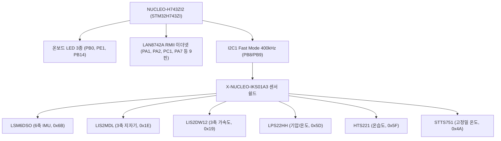

# nucleo-bsp

STMicroelectronics **NUCLEO-H743ZI2** 개발 보드 및 **X-NUCLEO-IKS01A3** 모션 MEMS/환경 센서 확장 보드를 위한 순수 Rust `no_std` Board Support Package (BSP)이다.

---

## 1. 개요 및 하드웨어 매핑

본 크레이트는 하드웨어 레지스터 제어에 필요한 핀 매핑, 버스 클록 상수, 보드 온보드 장치(LED, 이더넷 RMII), 그리고 IKS01A3 6종 센서 레지스터/주소를 단일 진실 공급원(SSOT)으로 캡슐화하여 제공한다.



### ① 온보드 I/O 및 핀아웃 매핑
- **사용자 LED (BoardLeds)**:
  - `LED1` (Green): `PB0`
  - `LED2` (Yellow): `PE1`
  - `LED3` (Red): `PB14`
- **사용자 푸시 버튼**: `PC13`
- **I2C1 센서 통신 버스**:
  - `SCL`: `PB8` (Arduino D15)
  - `SDA`: `PB9` (Arduino D14)
  - 버스 속도: `I2C_FAST_MODE_HZ` (400 kHz)
- **온보드 LAN8742A RMII 이더넷 핀셋 (BoardRmiiPins)**:
  - `REF_CLK`: `PA1`, `MDIO`: `PA2`, `MDC`: `PC1`, `CRS_DV`: `PA7`
  - `RXD0`: `PC4`, `RXD1`: `PC5`, `TXD0`: `PG13`, `TXD1`: `PB13`, `TX_EN`: `PG11`

---

## 2. X-NUCLEO-IKS01A3 6종 센서 레지스터 맵

`nucleo_bsp::iks01a3` 모듈을 통해 7비트 슬레이브 I2C 주소, WHO_AM_I 식별값, 컨트롤 레지스터 및 출력 데이터 레지스터 오프셋을 제공한다:

| 센서 칩셋 | 7-bit I2C 주소 | WHO_AM_I 주소 | 정상 응답값 | 주요 레지스터 상수 모듈 |
| :--- | :---: | :---: | :---: | :--- |
| **LSM6DSO** (6축 IMU) | `0x6B` | `0x0F` | `0x6C` | `iks01a3::lsm6dso` |
| **LIS2MDL** (3축 지자기) | `0x1E` | `0x4F` | `0x40` | `iks01a3::lis2mdl` |
| **LIS2DW12** (3축 보조 가속도) | `0x19` | `0x0F` | `0x44` | `iks01a3::lis2dw12` |
| **LPS22HH** (기압 센서) | `0x5D` | `0x0F` | `0xB3` | `iks01a3::lps22hh` |
| **HTS221** (온습도 센서) | `0x5F` | `0x0F` | `0xBC` | `iks01a3::hts221` |
| **STTS751** (디지털 온도 센서) | `0x4A` | `0x01` | `0x01` | `iks01a3::stts751` |

### 센서 보정 및 감도 변환
- **HTS221 OTP 캘리브레이션 (`hts221_calib.rs`)**:
  - 센서 내부 비휘발성 메모리에 기록된 온도/습도 선형 보간 계수($H_0, H_1, T_0, T_1$)를 읽어 고정밀 실수 환산 제공.
- **감도 계수 변환 (`sensitivity.rs`)**:
  - LSB 단위 원시 정수 데이터를 표준 단위($\text{m/s}^2$, $\text{rad/s}$, $\text{gauss}$, $\text{hPa}$, $^\circ\text{C}$)로 변환하는 무동적할당 인라인 유틸리티.

---

## 3. 온칩 고유 ID (UID) 및 MAC 주소 파생

`nucleo_bsp::uid` 모듈을 통해 STM32H743ZI의 96비트 고유 디바이스 ID 레지스터(`0x1FF1_E800`)를 안전하게 조회하고, 충돌 없는 고유 MAC 주소(EUI-48 규격, 로컬 관리 비트 설정)를 생성한다:

```rust
use nucleo_bsp::uid::get_unique_mac_address;

// 96-bit 칩 고유 ID를 해싱하여 고유 MAC 주소 자동 생성
let mac_addr: [u8; 6] = get_unique_mac_address();
// [0x02, 0x80, 0xE1, ...] (STMicroelectronics OUI 기반 로컬 유니캐스트)
```

---

## 4. 사용 방법 (Usage Example)

```rust
#![no_std]
#![no_main]

use embassy_executor::Spawner;
use embassy_stm32::i2c::I2c;
use embassy_stm32::time::Hertz;
use nucleo_bsp::iks01a3::{ADDR_LSM6DSO, lsm6dso};
use nucleo_bsp::{BoardLeds, I2C_FAST_MODE_HZ};

#[embassy_executor::main]
async fn main(_spawner: Spawner) {
    let p = embassy_stm32::init(Default::default());

    // 1. 온보드 3색 LED 초기화
    let mut leds = BoardLeds::new(p.PB0, p.PE1, p.PB14);
    leds.green.set_high();

    // 2. I2C1 400kHz 센서 버스 초기화
    let mut i2c = I2c::new_blocking(p.I2C1, p.PB8, p.PB9, I2C_FAST_MODE_HZ, Default::default());

    // 3. 센서 WHO_AM_I 식별 검증
    let mut whoami = [0u8; 1];
    if i2c.blocking_write_read(ADDR_LSM6DSO, &[lsm6dso::WHO_AM_I], &mut whoami).is_ok() {
        if whoami[0] == lsm6dso::WHO_AM_I_VAL {
            leds.yellow.set_high();
        }
    }
}
```
