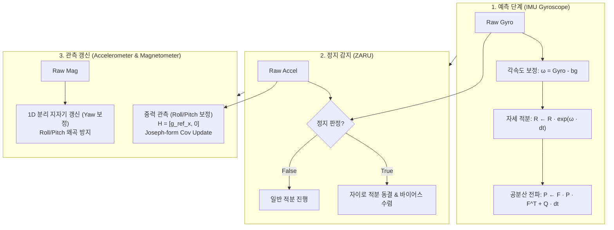

# so3-inekf: $SO(3)$ Right-Invariant Extended Kalman Filter

본 크레이트는 Cortex-M7 등 자원 제약적인 임베디드 MCU 환경을 위한 순수 `no_std`, Zero-Heap $SO(3)$ Right-Invariant Extended Kalman Filter (InEKF) 라이브러리이다.

쿼터니언 기반 표준 EKF나 상용 AHRS(Madgwick, Mahony)의 선형화 오차 및 자이로 드리프트 취약점을 극복하기 위해, 리 군(Lie Group) 다양체 상에서 정의된 불변 오차(Invariant Error) 동역학을 기반으로 3차원 자세($SO(3)$ 회전 행렬) 및 3축 각속도계 바이어스를 정밀 추정한다.

---

## 1. 주요 특징 (Key Features)

- **순수 `no_std` 및 Zero-Heap 할당**: 동적 메모리 할당(`alloc`) 없이 고정 크기 스택 배열(`[[f32; 3]; 3]`, `[[f32; 6]; 6]`)만으로 모든 행렬 연산을 수행한다.
- **불변 확장 칼만 필터 (Right-Invariant InEKF)**:
  - 오차를 $\eta_t = \hat{R}_t R_t^T \in SO(3)$로 정의한다.
  - 관측 행렬(Jacobian)이 현재 자세 $\hat{R}$과 독립적인 상수 행렬($H = [\hat{g}_\times \quad 0]$)이 되어, 급격한 기동 시에도 일관된 수렴 성능을 보장한다.
- **수치적 안정성을 위한 Joseph-Form 공분산 갱신**:
  - $P \leftarrow (I - K H) P (I - K H)^T + K R_{\text{cov}} K^T$ 구조를 적용하여 부동소수점 반올림 오차로 인한 양의 정부호성(Positive-Definiteness) 훼손 및 필터 발산을 방지한다.
- **1차원 분리형 지자기 방위 갱신 (1D Decoupled Yaw Update)**:
  - 수평 자세(Roll/Pitch)는 중력 가속도계에 의해서만 구속되며, 지자기 센서는 오직 지면 수직축 기준의 헤딩(Yaw) 오차만을 보정하여 실내 자성체 왜곡에 의한 수평면 오염을 방지한다.
- **ZARU (Zero Angular Rate Update) 정지 감지 메커니즘**:
  - 가속도 크기 및 자이로 분산을 감시하여 정지 상태 판정 시 자이로 적분을 동결하고 바이어스를 보정한다.
- **오라클 차등 검증 (Oracle Differential Testing)**:
  - 호스트 x86_64 환경에서 `nalgebra` 참조 모델과의 19개 단위 테스트를 통해 숄레스키 분해(Cholesky Factorization) 양의 정부호성 및 특이점(Singularity) 테일러 전개 안정성을 검증한다.

---

## 2. 수학적 정식화 (Mathematical Formulation)

### ① 리 군 $SO(3)$ 지수 사상 및 대수
3차원 회전 벡터 $\boldsymbol{\phi} \in \mathbb{R}^3$에 대한 반대칭 행렬 연산자 $(\cdot)_\times$와 로드리게스 지수 사상(Rodrigues' Exponential Map)은 다음과 같다:

$$\boldsymbol{\phi}_\times = \begin{bmatrix} 0 & -\phi_z & \phi_y \\ \phi_z & 0 & -\phi_x \\ -\phi_y & \phi_x & 0 \end{bmatrix}$$

$$\exp(\boldsymbol{\phi}) = I + \frac{\sin \theta}{\theta} \boldsymbol{\phi}_\times + \frac{1 - \cos \theta}{\theta^2} \boldsymbol{\phi}_\times^2 \quad (\theta = \|\boldsymbol{\phi}\|)$$

$\theta < 10^{-4}$ 근방에서는 수치적 0 나누기(Divide-by-Zero)를 방지하기 위해 테일러 급수 전개를 적용한다.

### ② 상태 변수 및 오차 정의
필터의 추정 상태 벡터와 오차 정의는 다음과 같다:
- **상태 추정치**: $\hat{X} = (\hat{R}, \hat{\mathbf{b}}_g) \in SO(3) \times \mathbb{R}^3$
- **Right-Invariant 자세 오차**: $\eta = \hat{R} R^T \approx I + \boldsymbol{\xi}_\times$ ($\boldsymbol{\xi} \in \mathbb{R}^3$)
- **바이어스 오차**: $\Delta \mathbf{b}_g = \hat{\mathbf{b}}_g - \mathbf{b}_g$

### ③ 상태 및 공분산 파이프라인



---

## 3. 모듈 구성 및 API 구조

| 모듈 | 구조체 / 타입 | 설명 |
| :--- | :--- | :--- |
| `so3` | `So3` | 3x3 직교 회전 행렬 구조체. Exp, Log, Rotate, Euler/Quaternion 변환 지원 |
| `inekf` | `RightInvariantInEKF` | InEKF 필터 엔진. 예측, 가속도 갱신, 지자기 갱신, 정지 판정 수행 |
| `inekf` | `InEKFConfig` | 센서 노이즈 공분산($Q_g, Q_b, R_{\text{acc}}, R_{\text{mag}}$) 및 기준 중력 설정 빌더 |
| `inekf` | `StillnessConfig` | 정지 판정 가속도/자이로 임계값 및 윈도우 카운터 파라미터 |

---

## 4. 사용 예제 (Usage Example)

```rust
use so3_inekf::{InEKFConfig, RightInvariantInEKF, So3};

fn main() {
    // 1. 센서 사양 기반 기본 설정 생성 (LSM6DSO 및 LIS2MDL 기준)
    let config = InEKFConfig::for_lsm6dso_and_lis2mdl(9.80665);
    let mut filter = RightInvariantInEKF::with_config(config);

    // 2. 주기적 예측 및 갱신 루프 (100 Hz 예시)
    let dt = 0.01;
    let raw_gyro = [0.01, -0.02, 0.00];     // [rad/s]
    let raw_accel = [0.0, 0.0, 9.80665];    // [m/s^2]
    let raw_mag = [0.25, 0.05, -0.42];      // [Gauss / Normalized]

    // 2-1. 정지 감지 판정
    filter.update_stillness(raw_gyro, raw_accel);

    // 2-2. 자세 예측 (자이로 적분)
    filter.predict(raw_gyro, dt);

    // 2-3. 중력 가속도 관측 갱신 (Roll / Pitch)
    filter.update_accel(raw_accel);

    // 2-4. 분리형 지자기 관측 갱신 (Yaw)
    filter.update_mag(raw_mag);

    // 3. 추정 결과 획득
    let (roll, pitch, yaw) = filter.rot.to_euler_deg();
    let q = filter.rot.to_quaternion();
    let gyro_bias = filter.bias_gyro;
}
```

---

## 5. 빌드 및 테스트

호스트 환경(`x86_64`)에서 `nalgebra` 참조 모델을 활용한 수학적 무결성 테스트를 실행할 수 있다:

```bash
# 호스트 단위 테스트 실행
cargo test -p so3-inekf --target x86_64-unknown-linux-gnu

# 타깃 임베디드 크로스 빌드 검증
cargo build -p so3-inekf --target thumbv7em-none-eabihf
```
