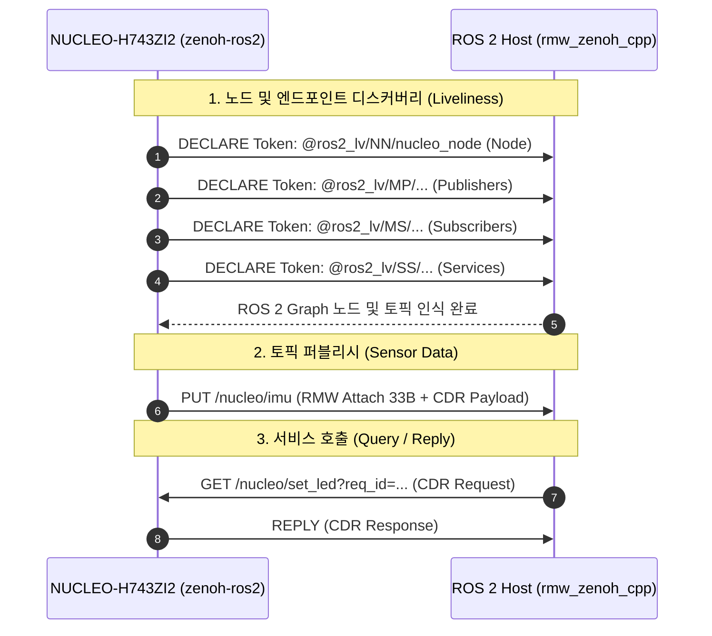

# zenoh-ros2: Pure Rust Embedded ROS 2 Client via Zenoh

본 크레이트는 Cortex-M 및 자원 제약적인 임베디드 MCU를 위한 순수 `no_std`, Zero-Heap 동적 할당 ROS 2 통신 라이브러리이다.

Micro-XRCE-DDS Agent나 중간 브리지 데몬 없이, 이더넷/UDP 소켓을 통해 ROS 2 Jazzy의 차세대 미들웨어인 `rmw_zenoh_cpp`와 와이어 레벨(Wire Protocol)에서 직접 통신한다.

---

## 1. 주요 특징 (Key Features)

- **순수 `no_std` 및 Zero-Heap 아키텍처**:
  - `alloc` 크레이트에 의존하지 않으며, 런타임 동적 힙 할당을 일절 수행하지 않는다.
  - 고정 크기 스택 버퍼만을 활용하여 메모리 파편화를 원천 차단한다.
- **하드웨어 및 네트워크 스택 독립성**:
  - 특정 MCU HAL(`embassy-stm32` 등)이나 TCP/IP 스택(`smoltcp` 등)에 종속되지 않는다.
  - 바이트 슬라이스(`&[u8]`, `&mut [u8]`) 기반으로 동작하여 어떤 네트워크 드라이버와도 즉각 연동 가능하다.
- **ROS 2 Jazzy `rmw_zenoh_cpp` 100% 호환**:
  - Zenoh 1.0 프로토콜 규격 및 RMW Liveliness Token(`@ros2_lv/...`)을 준수한다.
  - ROS 2 그래프(`ros2 node list`, `ros2 topic list`, `ros2 service list`)에 표준 노드로 완벽히 인식된다.
- **시퀀스 번호 캡슐화를 통한 메시지 손실 방어**:
  - `Publisher<T>` 내부에서 단조 증가 시퀀스 번호(`seq: i64`)를 독립적으로 관리하여, `rmw_zenoh_cpp`의 `A message was lost!` 오탐지 및 패킷 드롭 결함을 방지한다.
- **OCP(개방-폐쇄 원칙) 기반 엔드포인트 자동 등록 (`DiscoveryRegistry`)**:
  - 퍼블리셔, 서브스크라이버, 서비스 서버를 레지스트리에 등록하면 단일 루프에서 노드 및 인터페이스 활성 토큰을 자동 일괄 선언한다.

---

## 2. 프로토콜 및 와이어 규격 (Wire Protocol Specification)

### ① 계층형 패킷 구조 (Layered Frame Hierarchy)

Zenoh 1.0 UDP 데이터그램 내부의 계층 구조는 다음과 같다:

```
+---------------------------------------------------------------------------------+
| Zenoh Frame Header (0x05)                                                       |
+---------------------------------------------------------------------------------+
| Zenoh PUSH Header (0x1D) | Resource Key (Expr ID / String)                     |
+---------------------------------------------------------------------------------+
| Zenoh PUT Header (0x01)  | Payload Length                                       |
+---------------------------------------------------------------------------------+
| 33-Byte RMW Attachment                                                          |
| - Monotonic Sequence (8B i64 LE)                                                |
| - Timestamp (8B i64 LE, nanoseconds)                                            |
| - GID Length (1B: 0x10) + GID (16B)                                             |
+---------------------------------------------------------------------------------+
| Micro-CDR Payload                                                               |
| - CDR Header (4B: 0x00, 0x01, 0x00, 0x00)                                       |
| - Serialized ROS 2 Message (Aligned 4B/8B)                                      |
+---------------------------------------------------------------------------------+
```

### ② 통신 시퀀스 다이어그램



---

## 3. 핵심 모듈 구성

| 모듈 | 구조체 / 트레이트 | 설명 |
| :--- | :--- | :--- |
| `wire` | `ZenohWire` | Zenoh 1.0 프레임 헤더, RMW Attachment, DECLARE 패킷 직렬화 유틸리티 |
| `cdr` | `CdrWriter`, `CdrReader` | 4/8바이트 정렬을 자동 처리하는 `no_std` Micro-CDR 직렬화기 |
| `traits` | `RosMessage`, `RosService` | ROS 2 타입 시그니처 및 직렬화/역직렬화 계약 트레이트 |
| `publisher` | `Publisher<T>` | 캡슐화된 시퀀스 번호 기반 ROS 2 토픽 송신기 |
| `subscriber` | `Subscriber<T>` | 키 매칭 및 CDR 페이로드 역직렬화 수신기 |
| `service` | `ServiceServer<S>` | ROS 2 서비스 Queryable 선언 및 Reply 프레임 생성기 |
| `registry` | `DiscoveryRegistry` | 노드 인터페이스 Liveliness 일괄 등록 및 선언 레지스트리 |
| `types` | `Header`, `Vector3`, `Quaternion`, `Twist`, `set_bool` | 자주 사용되는 표준 ROS 2 메시지 및 서비스 타입 구현체 |

---

## 4. 사용 예제 (Usage Example)

### ① 퍼블리셔 및 레지스트리 설정

```rust
use zenoh_ros2::{DiscoveryRegistry, Publisher, RosMessage, ZenohWire};
use zenoh_ros2::types::Twist;

// 1. 디스커버리 레지스트리 생성
let mut registry = DiscoveryRegistry::new("nucleo_node", "");

// 2. 퍼블리셔 인스턴스 생성 (16바이트 고유 GID 부여)
let gid = [1u8; 16];
let mut cmd_pub = Publisher::<Twist>::new("nucleo/cmd_vel", gid);

// 3. 레지스트리에 퍼블리셔 등록
registry.register_publisher(&cmd_pub).expect("Registry full");

// 4. 네트워크 소켓을 통해 Liveliness Token 일괄 선언 전송
let mut tx_buf = [0u8; 512];
for i in 0..registry.token_count() {
    let token = registry.get_token(i).unwrap();
    let len = ZenohWire::write_declare_token(token, &mut tx_buf).unwrap();
    // socket.send(&tx_buf[..len]);
}

// 5. 메시지 퍼블리시
let twist = Twist {
    linear: [1.0, 0.0, 0.0],
    angular: [0.0, 0.0, 0.5],
};
let now_ns = 1_700_000_000_000_000_000i64;
let packet_len = cmd_pub.serialize_publish(&twist, now_ns, &mut tx_buf).unwrap();
// socket.send(&tx_buf[..packet_len]);
```

### ② 서비스 요청 수신 및 응답

```rust
use zenoh_ros2::ServiceServer;
use zenoh_ros2::types::set_bool::{SetBool, SetBoolRequest, SetBoolResponse};

let srv_gid = [2u8; 16];
let mut led_service = ServiceServer::<SetBool>::new("nucleo/set_led", srv_gid);

// 수신된 UDP 버퍼(rx_buf)에서 서비스 요청 검증 및 파싱
let rx_payload = &rx_buf[..rx_len];
if let Some((req_id, req)) = led_service.parse_request(rx_payload) {
    // 비즈니스 로직 수행
    let success = req.data;
    let message = if success { "LED ON" } else { "LED OFF" };

    // 응답 프레임 생성
    let resp = SetBoolResponse { success, message };
    let reply_len = led_service.serialize_reply(req_id, &resp, &mut tx_buf).unwrap();
    // socket.send(&tx_buf[..reply_len]);
}
```

---

## 5. 빌드 및 테스트

호스트 환경(`x86_64`)에서 CDR 직렬화 무결성 및 와이어 프로토콜 단위 테스트를 실행할 수 있다:

```bash
# 호스트 단위 테스트 실행
cargo test -p zenoh-ros2 --target x86_64-unknown-linux-gnu

# 타깃 임베디드 크로스 빌드 검증
cargo build -p zenoh-ros2 --target thumbv7em-none-eabihf
```
