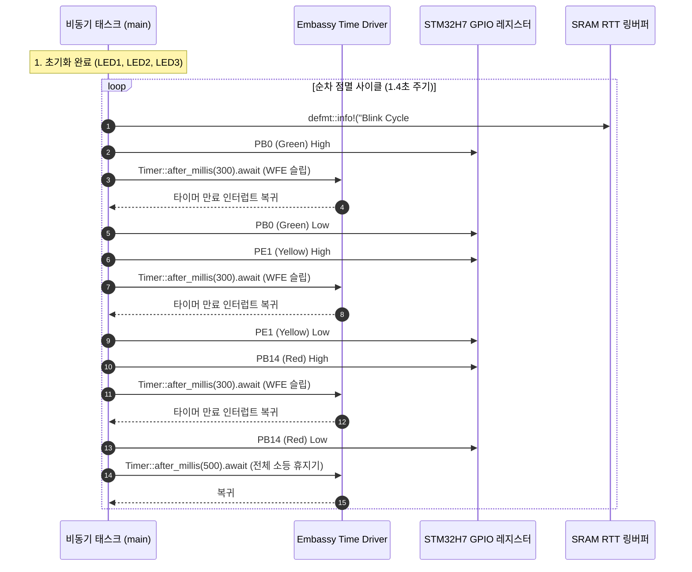
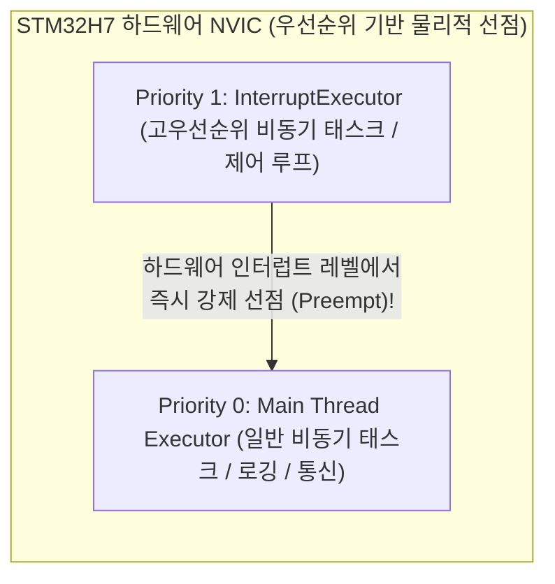

# NUCLEO-H743ZI2 Embassy 온보드 LED 순차 점멸 예제 (01_blinky)

## 1. 개요 및 설계 배경 (Overview & Context)
- **목적**: 본 예제는 NUCLEO-H743ZI2 개발 보드의 기본 하드웨어 동작 상태를 검증하는 Step 0 브링업(Bring-up) 펌웨어이다.
- **해결 과제**:
  - STM32H743ZI MCU의 기본 전원 공급, 클럭 트리 및 GPIO 출력 드라이버의 정상 작동 확인.
  - 별도의 UART 시리얼 배선 없이 ST-LINK/V3E 온보드 디버거를 통한 `defmt` + RTT 초고속 무간섭 로깅 파이프라인 검증.
  - 전용 하드웨어 추상화 계층인 `nucleo-bsp`의 `BoardLeds` API 정상 연동 확인.

---

## 2. 시스템 구조 및 데이터 흐름 (Architecture & Data Flow)

### ① 하드웨어 핀 매핑 (Hardware Pinout)
NUCLEO-H743ZI2 보드에 실장된 3개의 사용자 LED를 제어한다.

| 심볼 | LED 명칭 | 실장 색상 | MCU GPIO 핀 | 로직 레벨 | 초기 상태 |
| :--- | :--- | :--- | :--- | :--- | :--- |
| `leds.green` | LED1 | 녹색 (Green) | `PB0` | High = ON / Low = OFF | Low (OFF) |
| `leds.yellow` | LED2 | 노란색 (Yellow) | `PE1` | High = ON / Low = OFF | Low (OFF) |
| `leds.red` | LED3 | 적색 (Red) | `PB14` | High = ON / Low = OFF | Low (OFF) |

### ② 비동기 제어 루프 파이프라인 (Execution Flow)



---

## 3. 핵심 구현 메커니즘 (Key Implementation Mechanisms)

### ① `nucleo-bsp` 기반의 하드웨어 추상화 (`nucleo_bsp::BoardLeds`)
- 개별 예제에서 매번 원시 GPIO 핀 번호(`p.PB0`, `p.PE1`, `p.PB14`)를 하드코딩하지 않고, `BoardLeds::new(...)` 팩토리 메서드를 호출하여 구조체 단위로 제어권을 획득한다.
- 잘못된 핀 할당이나 중복 점유를 컴파일 타임에 Rust의 소유권(Ownership) 규칙으로 원천 방지한다.

### ② 논블로킹 비동기 타이머 (`Timer::after_millis(...).await`)
- `cortex_m::asm::delay()`와 같은 비지 웨이트(Busy-wait) 루프는 CPU 코어를 100% 점유하여 전력을 낭비하고 다른 작업을 방해한다.
- 본 예제는 `embassy-time` 드라이버를 사용하여 대기 시간 동안 Cortex-M7 코어를 저전력 슬립 모드(`WFI`/`WFE`)로 전환하고, 하드웨어 타이머 인터럽트로 복귀하는 협력적 멀티태스킹 방식을 채택한다.

### ③ Zero-UART 고속 RTT 로깅 (`defmt::info!`)
- 텍스트 포맷팅을 타깃 MCU에서 수행하지 않고, 정수 식별자와 바이트 인자만 SRAM의 RTT 버퍼에 고속 기록한다.
- 호스트의 `probe-rs`가 SWD 버스를 통해 이를 읽어와 역복원하므로 CPU 연산 지연이 거의 발생하지 않는다.

---

## 4. 심층 분석: RTT 메커니즘과 Rust `defmt`의 차별성 (Deep Dive: RTT & defmt)

### ① RTT (Real-Time Transfer)의 본질과 C/C++ 생태계
- **기원**: RTT는 SEGGER가 자사 J-Link 디버거를 위해 고안한 통신 규격으로, 언어에 종속되지 않는 하드웨어 디버그 기술이다.
- **C/C++에서의 사용**: C/C++ 임베디드 프로젝트에서도 `SEGGER_RTT.c` 소스를 포함하여 `SEGGER_RTT_printf(0, "val: %d\r\n", val)` 형태로 UART 대체재로 널리 사용해 왔다.
- **물리 계층 동작 원리**: 칩 내부 SRAM에 `_SEGGER_RTT` 제어 블록(링 버퍼)을 할당해 두고, ST-LINK나 J-Link 디버거가 SWD(Serial Wire Debug) 버스의 AHB-AP(Access Port)를 통해 CPU를 멈추지 않고(Non-intrusive) 메모리를 직접 읽어 호스트 PC로 스트리밍한다.

### ② C/C++ 일반 RTT vs Rust `defmt` 비교 분석

RTT 하드웨어 채널은 동일하지만, **"문자열 서식화(Formatting)를 어디에서 수행하는가"**에서 결정적 아키텍처 차이가 발생한다.

| 비교 항목 | C/C++ 전통적 RTT (`SEGGER_RTT_printf`) | Rust 생태계 (`defmt::info!`) |
| :--- | :--- | :--- |
| **통신 물리 채널** | SRAM RTT 링 버퍼 (SWD 읽기) | SRAM RTT 링 버퍼 (SWD 읽기) |
| **포맷 서식 문자열 저장소** | **MCU 플래시 메모리 (ROM)** | **호스트 PC ELF 심볼 테이블** (MCU 점유 0B) |
| **문자열 변환 연산 주체** | **MCU Cortex-M7 코어** | **호스트 PC CPU (`probe-rs`)** |
| **버퍼에 기록되는 페이로드** | 완성된 ASCII 문자열 (수십 바이트) | **정수 토큰 ID + 원시 바이트** (2~4바이트) |
| **CPU 실행 지연 시간** | 수 마이크로초 ~ 수십 마이크로초 | **수십 나노초 (수 CPU 사이클)** |
| **타이밍 왜곡 (Heisenbug)** | 포맷팅 부하로 실시간 루프 교란 가능 | 부하가 극소화되어 타이밍 왜곡 실질적 배제 |

### ③ C/C++ 환경과의 비교 및 Rust의 엔지니어링 혁신
- **C/C++에서의 포맷팅 지연 시도**: C/C++에서도 Google의 `Pigweed (pw_tokenizer)`나 일부 차량용 트레이서가 유사한 토큰화 방식을 지원하지만, 복잡한 매크로 트릭, 별도의 후처리 파이썬 스크립트, 독립 데몬 프로세스를 빌드 시스템(CMake/GN)에 수동 결합해야 하는 진입장벽이 존재한다.
- **Rust의 네이티브 통합**: Rust는 컴파일러 단계의 프로시저 매크로(Proc Macro)와 링커 섹션 제어 능력을 바탕으로, 개발자가 추가 툴체인 설정 없이 `Cargo.toml` 의존성과 `probe-rs` 러너만으로 이 고도화된 포맷팅 지연 파이프라인을 원클릭(`cargo run`)으로 사용할 수 있도록 완성도를 끌어올렸다.

### ④ 개발 편의성(Developer Experience) 관점의 워크플로우 통합
단순한 물리 채널의 차이를 넘어, 디버깅을 수행하는 개발자 경험(DX)에서 매우 큰 생산성 격차가 존재한다:
- **전통적인 C/C++ 디버깅 워크플로우**:
  - 펌웨어 컴파일 및 플래시 도구와 RTT 로그 뷰어가 물리적으로 분리되어 있다.
  - 빌드/플래시 후, SEGGER의 `JLinkRTTViewer` 같은 별도 GUI 툴을 띄우거나, 백그라운드에 GDB 서버/OpenOCD를 띄우고 텔넷(Telnet) 포트(예: localhost:19021)로 별도 터미널 세션을 열어 접속해야 한다.
  - ST-LINK 환경에서는 OpenOCD 설정 스크립트 작성 및 RTT 제어 블록 심볼 주소 탐색 등 추가 세팅 오버헤드가 발생한다.
- **현대적 Rust 임베디드 워크플로우**:
  - `probe-rs` 러너가 모든 과정을 단일 파이프라인으로 흡수 통합했다.
  - 개발자가 `cargo run -p blinky_01` 단 한 줄을 실행하면, 툴체인이 **[1. 코드 빌드 ➔ 2. SWD 타깃 플래시 ➔ 3. 칩 리셋 ➔ 4. SRAM RTT 채널 자동 탐색 ➔ 5. 바이너리 역직렬화 ➔ 6. 컬러 서식 터미널 출력]**을 원스톱으로 처리한다.

### ⑤ 아키텍처적 결론 및 종합 요약
- **공통점**: RTT라는 고속 하드웨어 채널 자체는 언어나 플랫폼에 독립적인 기술이며, C/C++ 프로젝트에서도 완벽하게 동작한다.
- **차별점 (편의성과 극한의 성능 최적화)**:
  - C/C++ 환경에서는 별도의 도구들을 복합적으로 조합해야 했던 하드웨어 RTT 고속도로를, Rust는 **`probe-rs` 러너를 통해 가장 직관적인 단일 CLI 인터페이스로 추상화**했다.
  - 나아가 단순 전송 채널 활용에 그치지 않고, 컴파일러 레벨의 **`defmt` 지연 포맷팅 기술을 결합하여 실어 나르는 짐(문자열 조합 CPU 연산 및 ROM 플래시 점유) 자체를 호스트 PC로 전면 오프로딩**함으로써 칩의 리소스 부담을 물리적 극한까지 경감시켰다.

### ⑥ 주요 응용: 고속 이벤트 추적 및 고급 프로파일링 (Advanced Profiling Applications)
초저지연 RTT와 제로-오버헤드 `defmt`의 결합은 단순한 디버그 텍스트 출력을 넘어, 전통적 UART 환경에서는 불가능했던 정밀 계측 영역을 열어준다:

1. **태스크 간 문맥 전환(Context Switching) 실시간 추적**:
   - FreeRTOS나 Embassy 비동기 런타임 스케줄러가 작업 바통을 넘기는 순간(수 µs 이내), 훅 함수에서 단 50ns 만에 `[Task A -> Task B]` 이벤트 토큰을 RTT 버퍼에 남긴다.
   - 실제로 임베디드 업계 표준 프로파일러인 **SEGGER SystemView**가 바로 이 RTT 기술을 기반으로 태스크 선점(Preemption)과 실행 타임라인 그래프를 시각화한다.
2. **고속 인터럽트(ISR) 실행 시간 및 지터(Jitter) 계측**:
   - STM32H743의 Cortex-M7 코어 내장 **DWT (Data Watchpoint and Trace)의 `CYCCNT` (Cycle Counter)**와 결합하면 극한의 정밀도 달성이 가능하다.
   - 480 MHz 동작 기준 **1 사이클은 약 2.08 나노초(ns)**이므로, 외부 핀 인터럽트 진입/종료 사이클 카운트를 RTT로 가볍게 밀어 넣어 나노초 단위의 실행 시간과 응답 지연(Latency) 지터를 실시간 포착할 수 있다.
3. **인터럽트 중첩(Nesting) 및 우선순위 역전(Priority Inversion) 병목 포착**:
   - 고우선순위 인터럽트가 저우선순위 ISR을 선점하거나, 특정 드라이버가 임계 구역(Critical Section)을 과도하게 길게 점유하여 발생하는 시스템 병목을 실시간성 왜곡 없이 그대로 적발할 수 있다.
4. **본 프로젝트(NUCLEO-H743ZI2) 센서 파이프라인 적용 전망**:
   - 향후 [Step 3/4]의 **LSM6DSO 6.66 kHz 고속 가속도 데이터 레디(DRDY) 인터럽트**, **I2C DMA 버퍼 완료 인터럽트**, **Madgwick AHRS 자세 추정 태스크**가 480 MHz 위에서 동시 다발적으로 경쟁할 때, CPU 연산 능력을 1%도 잠식하지 않으면서 각 태스크의 기상/수면 주기를 마이크로초 단위로 완벽하게 감시할 수 있는 토대가 된다.

---

## 5. 심층 분석: 임베디드 비동기 프레임워크 Embassy의 설계 철학 (Deep Dive: Embassy Framework)

### ① 등장 배경: 임베디드 동시성 모델의 양대 딜레마
전통적 C/C++ 임베디드 소프트웨어 개발에서는 복수의 센서와 통신 주변장치를 동시에 제어하기 위해 두 가지 방식 중 하나를 선택해야만 했다:
1. **베어메탈 슈퍼루프 (Superloop & State Machine)**:
   - `while(1)` 루프 안에서 비차단 방식으로 상태 머신을 손수 작성.
   - 단점: 코드 복잡도가 지수적으로 증가하고, 단 하나의 함수라도 블로킹 지연(`delay_ms`)을 일으키면 전체 시스템의 주기가 붕괴함.
2. **전통적 선점형 RTOS (FreeRTOS, ThreadX 등)**:
   - 태스크마다 독립된 스레드를 띄우고 선점형 스케줄링 수행.
   - 단점: **태스크마다 독립된 개별 스택(최소 1~2 KB 이상)을 사전 할당**해야 하므로, RAM이 귀한 MCU에서 수십 KB의 메모리가 스택으로 낭비됨. 또한 스택 크기 예측 실패 시 알 수 없는 **스택 오버플로우(Stack Overflow)**로 인한 시스템 크래시 불안이 상존함.

### ② Embassy의 혁신: 스택리스 코루틴 (Stackless Coroutine)
Embassy는 Rust 언어 고유의 `async/await` 컴파일러 기능을 바탕으로 위 딜레마를 완전히 해소한다:
- **단일 스택 공유 (Single Main Stack)**:
  - Rust의 `async fn`은 컴파일 시점에 컴파일러에 의해 **초소형 유한상태머신(FSM) 구조체**로 자동 변환된다.
  - 모든 비동기 태스크는 별도의 전용 스택 공간을 할당받지 않고, **단 1개의 메인 스택을 공유**하며 실행된다.
  - 10개, 20개의 태스크를 동시에 스폰(Spawn)하더라도 태스크당 소비되는 RAM은 **불과 수십 바이트 수준(상태 변수 저장 공간)**에 불과하여 메모리 효율이 극대화된다.
- **문맥 전환 오버헤드 최소화**:
  - RTOS처럼 CPU 레지스터 수십 개를 RAM 스택에 푸시/팝하는 무거운 하드웨어 문맥 전환 대신, 단지 상태 머신의 열거형(Enum) 상태 값 하나를 바꾸고 리턴하는 가벼운 함수 호출 수준으로 전환된다.

### ③ 하드웨어 인터럽트와 `await`의 1:1 직결 및 자동 저전력
Embassy에서는 주변장치 대기 코드가 선형적이면서도 완벽한 비차단(Non-blocking) 및 저전력으로 동작한다:

```rust
// Embassy 비동기 I/O 대기 개념
let p = embassy_stm32::init(Default::default());
Timer::after_millis(300).await; // 300ms 동안 타이머 만료 대기
```

- **실행 내부 동작**:
  1. `await`가 호출되는 순간, 해당 태스크는 실행 권한을 `embassy-executor` 스케줄러에 반납하고 대기 큐로 들어간다.
  2. 실행할 다른 준비된 태스크가 없으면, 스케줄러는 Cortex-M7 코어를 즉시 **`WFI` (Wait For Interrupt) / `WFE` (Wait For Event) 초저전력 슬립 모드**로 진입시킨다.
  3. 지정된 하드웨어 타이머 또는 통신 DMA 인터럽트가 발생하는 순간, 칩이 깨어나면서 Rust의 **Waker** 메커니즘을 통해 대기 중이던 태스크만 정확히 `await` 다음 줄부터 즉시 실행을 재개한다.
- 개발자가 복잡한 인터럽트 서비스 루틴(ISR)과 콜백 함수, 글로벌 플래그 변수를 직접 다루지 않고도 **동기식 코드처럼 읽히는 안전한 비동기 코드**를 완성할 수 있다.

### ④ `embassy_*` 모듈 생태계 구성

| 크레이트 명칭 | 주요 역할 및 기능 | C/C++ 임베디드 대응 개념 |
| :--- | :--- | :--- |
| **`embassy-executor`** | 비동기 태스크 스케줄링 및 Waker 기반 실행 런타임 | RTOS 커널 스케줄러 |
| **`embassy-time`** | 마이크로초/밀리초 단위 비동기 지연 타이머 및 타임스탬프 | `vTaskDelay` / 소프트웨어 타이머 |
| **`embassy-stm32`** | STM32 전 제품군 전용 공식 HAL (GPIO, I2C, SPI, DMA, EXTI 비동기 제어) | STM32Cube HAL |
| **`embassy-sync`** | 태스크 간 무복사 데이터 통신 프리미티브 (`Channel`, `Mutex`, `Signal`) | FreeRTOS Queue / Semaphore |
| **`embassy-net`** | 하드웨어 이더넷 및 Wi-Fi 제어를 위한 순수 Rust no_std 네트워크 스택 | LwIP 스택 |

### ⑤ 스케줄링 정책과 실시간성: 협력적 스케줄링 vs 하드웨어 선점 (Scheduling & Preemption)

전통적 선점형 RTOS(FreeRTOS 등)의 관점에서 볼 때, Embassy의 스케줄링 및 실시간성(Real-Time) 정책은 **"소프트웨어 태스크 레벨의 협력적 스케줄링"**과 **"하드웨어 레벨의 강제 선점"**이 결합된 하이브리드 구조를 갖는다:



#### 1. 기본 태스크 정책: `.await` 기반 협력적(Cooperative) 스케줄링
- **시분할 선점 배제**: SysTick 타이머 틱마다 실행 중인 태스크를 임의의 지점에서 강제로 중단시키는 무차별 선점을 하지 않는다.
- **자발적 양보(Yield)**: 태스크는 오직 자신이 **`.await`를 호출한 지점에서만** 실행권을 스케줄러에 반납한다.
- **원자성(Atomicity) 확보와 락 오버헤드 소멸**: `.await`가 없는 연속된 연산 블록은 다른 비동기 태스크가 중간에 끼어들 수 없는 **자연스러운 원자적 실행 구간**이 된다. 따라서 전통적 RTOS에서 공유 변수 하나를 수정할 때마다 Mutex 락을 걸고 푸느라 낭비되던 오버헤드와 우선순위 역전(Priority Inversion) 문제가 근본적으로 제거된다.

#### 2. 하드 리얼타임(Hard Real-Time) 보장: 하드웨어 NVIC 다이렉트 선점
- 일반 태스크가 `.await` 없이 무거운 연산을 처리하고 있더라도, STM32H743의 하드웨어 인터럽트 컨트롤러(NVIC)는 **그 즉시 해당 태스크를 물리적으로 선점(Preempt)**하여 10 나노초 이내에 인터럽트 핸들러를 실행한다. 긴급 하드웨어 제어는 언제나 하드웨어가 직접 선점한다.

#### 3. 비동기 태스크 간 강제 선점: 다중 우선순위 실행기 (`InterruptExecutor`)
- "비동기(`async`) 태스크 중에서도 특정 제어 루프는 1 kHz로 일반 태스크를 뚫고 강제 선점해야 하는 경우", Embassy는 **`InterruptExecutor`**를 제공한다.
- STM32H7의 여유 소프트웨어 인터럽트 라인(SWI 등)에 고우선순위 비동기 실행기를 바인딩한다.
- 이 경우, 하위 우선순위 태스크(예: RTT 로깅)가 `.await`를 부르지 않고 돌고 있더라도, **하드웨어 인터럽트 신호가 트리거되면서 상위 비동기 태스크(예: IMU 필터)가 하위 태스크를 물리적으로 선점**하여 실행된다.

#### 4. FreeRTOS 선점형 모델 vs Embassy 모델 종합 비교

| 비교 항목 | FreeRTOS (전통적 선점형 RTOS) | Embassy (현대적 비동기 프레임워크) |
| :--- | :--- | :--- |
| **선점 주체** | OS 커널 소프트웨어 틱 (SysTick 1ms 주기) | **ARM Cortex-M NVIC (하드웨어 레벨 직결)** |
| **태스크 간 선점** | **강제 선점** (코드의 임의 지점에서 컨텍스트 스위칭) | **협력적 (`.await` 지점)** + **우선순위별 하드웨어 선점** |
| **데이터 레이스 위험** | 매우 높음 (모든 공유 변수에 Mutex 필수) | 극소화 (`.await` 사이 구간은 자연 원자성 보장) |
| **문맥 전환 비용** | 수 µs (레지스터 16~32개 스택 푸시/팝) | **수십 ns** (단순 FSM 상태 변수 값 변경) |
| **스택 메모리 소모** | 태스크마다 1~2 KB 분할 (스택 오버플로우 위험) | **단일 스택 공유** (태스크당 수십 Byte) |
| **실시간 지터(Jitter)** | 커널 스케줄러 틱에 의한 지터 존재 | **지터 없는 하드웨어 NVIC 다이렉트 처리** |

---

## 6. 엔지니어링 트레이드오프 및 인사이트 (Trade-offs & Insights)

### ① 장점 (Pros)
- **보드 브링업의 결정론적 검증**: LED 3색이 정확히 녹색 → 노란색 → 빨간색 순으로 회전하는 시각적 피드백을 통해 칩의 정상 클럭 공급 여부를 즉시 판별할 수 있다.
- **센서 예제 확장의 기반 확보**: 본 비동기 이벤트 루프 구조를 그대로 유지하면서, 향후 I2C 센서 폴링 태스크나 백그라운드 DMA 전송 태스크를 Spawner를 통해 병렬로 추가할 수 있다.

### ② 한계 및 주의점 (Cons & Constraints)
- **디버거 의존성**: `defmt` RTT 로그를 수신하기 위해서는 반드시 ST-LINK/V3E 디버거와 호스트의 `probe-rs` 세션이 활성화되어 있어야 한다. (단독 배터리 구동 시에는 LED 동작만 육안 확인 가능).
- **소프트웨어 지터**: 단순 LED 점멸에서는 무시할 만하나, 정밀한 마이크로초(µs) 단위 타이밍 제어가 필요한 경우 하드웨어 PWM 타이머 주변장치를 활용해야 한다.

---

## 7. 실행 및 검증 방법 (Run & Verification)

### ① 실행 명령어
NUCLEO-H743ZI2 보드가 USB로 연결된 상태에서 워크스페이스 최상위 루트에서 아래 명령을 실행한다:

```bash
cargo run -p blinky_01
```

### ② 기대 RTT 터미널 출력
```text
      INFO  ==========================================
      INFO  NUCLEO-H743ZI2 Embassy Blinky (Workspace)
      INFO  ==========================================
      INFO  BSP BoardLeds 초기화 완료 (LED1: PB0, LED2: PE1, LED3: PB14)
      INFO  Blink Cycle #1: 순차 점멸 시작
      INFO  Blink Cycle #2: 순차 점멸 시작
      INFO  Blink Cycle #3: 순차 점멸 시작
```

---

## 8. 관련 문서 및 소스코드 참조 (References)
- [예제 메인 소스코드](src/main.rs): `01_blinky` 비동기 점멸 구현체
- [예제 패키지 설정](Cargo.toml): `blinky_01` 크레이트 의존성 정의
- [BSP 라이브러리](../../crates/nucleo-bsp/src/lib.rs): 온보드 핀아웃 및 `BoardLeds` 구조체
- [전체 프로젝트 README](../../README.md): 프로젝트 로드맵 및 개발 환경 설정
