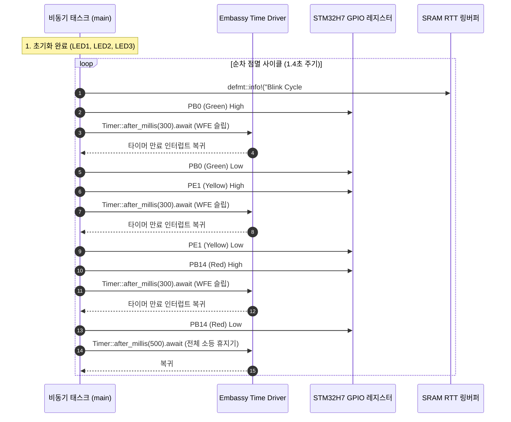

# NUCLEO-H743ZI2 Embassy 온보드 LED 순차 점멸 예제 (01_blinky)

## 1. 개요 및 설계 배경 (Overview & Context)
- **목적**: 본 예제는 NUCLEO-H743ZI2 개발 보드의 기본 하드웨어 동작 상태를 검증하는 Step 0 브링업(Bring-up) 펌웨어이다.
- **해결 과제**:
  - STM32H743ZI MCU의 기본 전원 공급, 클럭 트리 및 GPIO 출력 드라이버의 정상 작동 확인.
  - 별도의 UART 시리얼 배선 없이 ST-LINK/V3E 온보드 디버거를 통한 `defmt` + RTT 초고속 무간섭 로깅 파이프라인 검증.
  - 전용 하드웨어 추상화 계층인 `nucleo-bsp`의 `BoardLeds` API 정상 연동 확인.

---

## 2. 시스템 구조 및 데이터 흐름 (Architecture & Data Flow)

### ① 하드웨어 핀 매핑 (Hardware Pinout)
NUCLEO-H743ZI2 보드에 실장된 3개의 사용자 LED를 제어한다.

| 심볼 | LED 명칭 | 실장 색상 | MCU GPIO 핀 | 로직 레벨 | 초기 상태 |
| :--- | :--- | :--- | :--- | :--- | :--- |
| `leds.green` | LED1 | 녹색 (Green) | `PB0` | High = ON / Low = OFF | Low (OFF) |
| `leds.yellow` | LED2 | 노란색 (Yellow) | `PE1` | High = ON / Low = OFF | Low (OFF) |
| `leds.red` | LED3 | 적색 (Red) | `PB14` | High = ON / Low = OFF | Low (OFF) |

### ② 비동기 제어 루프 파이프라인 (Execution Flow)



---

## 3. 핵심 구현 메커니즘 (Key Implementation Mechanisms)

### ① `nucleo-bsp` 기반의 하드웨어 추상화 (`nucleo_bsp::BoardLeds`)
- 개별 예제에서 매번 원시 GPIO 핀 번호(`p.PB0`, `p.PE1`, `p.PB14`)를 하드코딩하지 않고, `BoardLeds::new(...)` 팩토리 메서드를 호출하여 구조체 단위로 제어권을 획득한다.
- 잘못된 핀 할당이나 중복 점유를 컴파일 타임에 Rust의 소유권(Ownership) 규칙으로 원천 방지한다.

### ② 논블로킹 비동기 타이머 (`Timer::after_millis(...).await`)
- `cortex_m::asm::delay()`와 같은 비지 웨이트(Busy-wait) 루프는 CPU 코어를 100% 점유하여 전력을 낭비하고 다른 작업을 방해한다.
- 본 예제는 `embassy-time` 드라이버를 사용하여 대기 시간 동안 Cortex-M7 코어를 저전력 슬립 모드(`WFI`/`WFE`)로 전환하고, 하드웨어 타이머 인터럽트로 복귀하는 협력적 멀티태스킹 방식을 채택한다.

### ③ Zero-UART 고속 RTT 로깅 (`defmt::info!`)
- 텍스트 포맷팅을 타깃 MCU에서 수행하지 않고, 정수 식별자와 바이트 인자만 SRAM의 RTT 버퍼에 고속 기록한다.
- 호스트의 `probe-rs`가 SWD 버스를 통해 이를 읽어와 역복원하므로 CPU 연산 지연이 거의 발생하지 않는다.

---

## 4. 엔지니어링 트레이드오프 및 인사이트 (Trade-offs & Insights)

### ① 장점 (Pros)
- **보드 브링업의 결정론적 검증**: LED 3색이 정확히 녹색 → 노란색 → 빨간색 순으로 회전하는 시각적 피드백을 통해 칩의 정상 클럭 공급 여부를 즉시 판별할 수 있다.
- **센서 예제 확장의 기반 확보**: 본 비동기 이벤트 루프 구조를 그대로 유지하면서, 향후 I2C 센서 폴링 태스크나 백그라운드 DMA 전송 태스크를 Spawner를 통해 병렬로 추가할 수 있다.

### ② 한계 및 주의점 (Cons & Constraints)
- **디버거 의존성**: `defmt` RTT 로그를 수신하기 위해서는 반드시 ST-LINK/V3E 디버거와 호스트의 `probe-rs` 세션이 활성화되어 있어야 한다. (단독 배터리 구동 시에는 LED 동작만 육안 확인 가능).
- **소프트웨어 지터**: 단순 LED 점멸에서는 무시할 만하나, 정밀한 마이크로초(µs) 단위 타이밍 제어가 필요한 경우 하드웨어 PWM 타이머 주변장치를 활용해야 한다.

---

## 5. 실행 및 검증 방법 (Run & Verification)

### ① 실행 명령어
NUCLEO-H743ZI2 보드가 USB로 연결된 상태에서 워크스페이스 최상위 루트에서 아래 명령을 실행한다:

```bash
cargo run -p blinky_01
```

### ② 기대 RTT 터미널 출력
```text
      INFO  ==========================================
      INFO  NUCLEO-H743ZI2 Embassy Blinky (Workspace)
      INFO  ==========================================
      INFO  BSP BoardLeds 초기화 완료 (LED1: PB0, LED2: PE1, LED3: PB14)
      INFO  Blink Cycle #1: 순차 점멸 시작
      INFO  Blink Cycle #2: 순차 점멸 시작
      INFO  Blink Cycle #3: 순차 점멸 시작
```

---

## 6. 관련 문서 및 소스코드 참조 (References)
- [예제 메인 소스코드](src/main.rs): `01_blinky` 비동기 점멸 구현체
- [예제 패키지 설정](Cargo.toml): `blinky_01` 크레이트 의존성 정의
- [BSP 라이브러리](../../crates/nucleo-bsp/src/lib.rs): 온보드 핀아웃 및 `BoardLeds` 구조체
- [전체 프로젝트 README](../../README.md): 프로젝트 로드맵 및 개발 환경 설정
