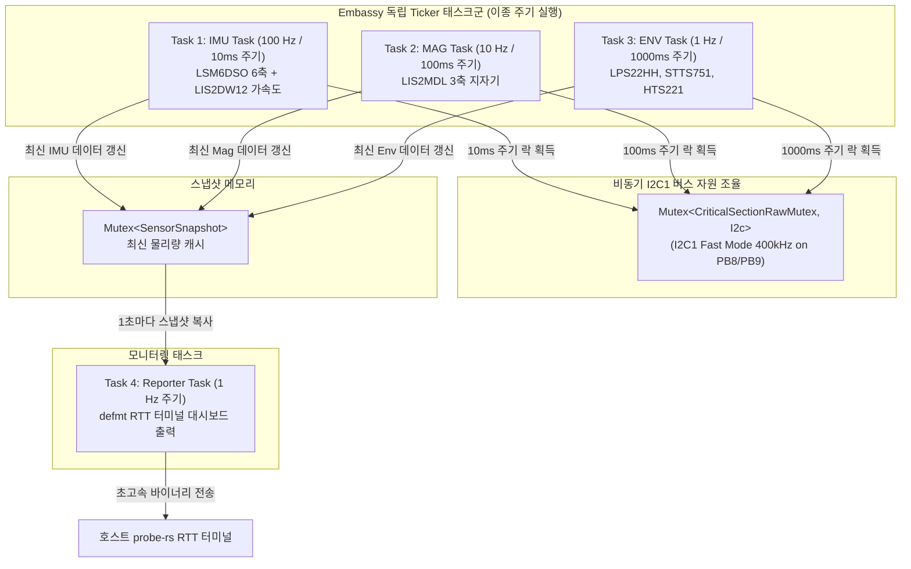
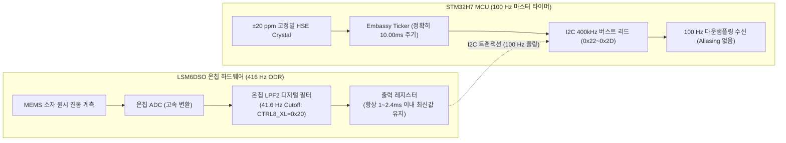

# X-NUCLEO-IKS01A3 6종 센서 이종 주기 비동기 샘플링 예제 (02_sensor_all_sampling)

## 1. 개요 및 설계 배경 (Overview & Context)
- **목적**: 본 예제는 NUCLEO-H743ZI2 개발 보드에 적층된 **X-NUCLEO-IKS01A3 모션 MEMS 및 환경 센서 쉴드**의 하드웨어 건전성을 전수 진단하고, 물리적 특성이 상이한 6종 센서를 **서로 다른 주기(100Hz, 10Hz, 1Hz)**로 동시 계측하는 고성능 비동기 센서 파이프라인 펌웨어이다.
- **해결 과제**:
  - **단일 샘플링 주기의 모순 극복**: 느린 온도 센서(열적 관성)와 고속 IMU(회전/가속도)를 동일 루프에서 처리하는 안티패턴을 탈피하여, 센서 대역폭에 최적화된 독립 주기를 부여한다.
  - **단일 I2C 물리 버스 경합(Bus Contention) 방어**: 10ms(100Hz), 100ms(10Hz), 1000ms(1Hz)로 비동기 실행되는 독립 태스크들이 동일한 I2C1 핀(PB8/PB9)을 동시 접근할 때 발생하는 충돌을 **비동기 뮤텍스(`CriticalSectionRawMutex`)**로 완벽하게 조율한다.

---

## 2. 시스템 구조 및 데이터 흐름 (Architecture & Data Flow)

### ① X-NUCLEO-IKS01A3 6종 센서 하드웨어 명세

| 센서 칩셋 | I2C 주소 | WHO_AM_I 레지스터 (기대값) | 할당 샘플링 주기 | 주요 측정 항목 및 환산 단위 |
| :--- | :--- | :--- | :--- | :--- |
| **LSM6DSO** | `0x6B` | `0x0F` (`0x6C`) | **100 Hz** (10ms) | 3축 가속도(±2g, 0.061 mg/LSB) + 3축 각속도(±250dps, 8.75 mdps/LSB) |
| **LIS2DW12** | `0x19` | `0x0F` (`0x44`) | **100 Hz** (10ms) | 3축 보조 선형 가속도(±2g, 0.244 mg/LSB) |
| **LIS2MDL** | `0x1E` | `0x4F` (`0x40`) | **10 Hz** (100ms) | 3축 지자기(1.5 mgauss/LSB, Continuous 모드) |
| **LPS22HH** | `0x5D` | `0x0F` (`0xB3`) | **1 Hz** (1000ms) | 24-bit 대기압(4096 LSB/hPa) + 16-bit 칩 내부 온도 |
| **STTS751** | `0x4A` | `0xFD` (`0x01`) | **1 Hz** (1000ms) | 12-bit 고정밀 주변 온도(0.0625 °C/LSB) |
| **HTS221** | `0x5F` | `0x0F` (`0xBC`) | **1 Hz** (1000ms) | 정전용량식 상대 습도(% rH) + 온도(°C) |

### ② 비동기 다중 주기 파이프라인 (Execution Pipeline)



---

## 3. 핵심 구현 메커니즘 (Key Implementation Mechanisms)

### ① 비동기 I2C 버스 뮤텍스 공유 (`Mutex<CriticalSectionRawMutex, Option<I2c>>`)
- 서로 다른 4개의 태스크(`task_imu_100hz`, `task_mag_10hz`, `task_env_1hz`, `init_sensors`)가 동일한 I2C1 인스턴스를 공유한다.
- 각 태스크는 `I2C_BUS.lock().await`를 통해 비동기 락을 획득하며, 버스가 다른 태스크에 의해 사용 중일 경우 CPU 비지 루프(Spinlock)가 아닌 **WFE 저전력 슬립 모드로 대기**하므로 전력과 CPU 점유율을 낭비하지 않는다.

### ② 400 kHz Fast Mode 버스 대역폭 확보
- 100 Hz IMU 샘플링 루프는 10ms마다 LSM6DSO 12바이트(가속도/자이로) 및 LIS2DW12 6바이트 등 총 20바이트 이상의 트랜잭션을 처리해야 한다.
- 표준 100 kHz I2C에서는 버스 전송 시간에만 2~3ms가 소요되어 버스 포화(Saturation)가 발생하므로, I2C1 버스 속도를 **`Hertz(400_000)` (Fast Mode)**로 설정하여 트랜잭션 점유 시간을 수백 마이크로초(µs) 이하로 단축했다.

### ③ 100% 정수 연산 기반의 고속 스케일링
- FPU가 탑재된 Cortex-M7이지만, 100 Hz 초고속 루프 내부에서의 부동소수점(`f32`) 연산 오버헤드를 극소화하기 위해 센서 레지스터 원시 바이트를 **고정소수점 및 정수 스케일링(`i32` 중간 연산)**으로 환산한다:
  - LSM6DSO Accel: `(raw * 61) / 1000` (mg)
  - LSM6DSO Gyro: `(raw * 875) / 100000` (dps)
  - LIS2MDL Mag: `(raw * 15) / 10` (mgauss)
  - LPS22HH Press: `(raw * 10) / 4096` (hPa × 10)
  - STTS751 Temp: `(high * 10) + ((low * 625) / 1000)` (°C × 10)

### ④ 센서 오버샘플링 및 온칩 LPF2 안티-에일리어싱(Anti-Aliasing) DSP 정책

센서 샘플링 시스템에서 MCU 타이머와 센서 내부 ODR 간의 관계는 단순한 수치 매칭 이상의 물리적·신호처리적 고려가 필요하다:



1. **마스터 타이밍 권한의 MCU 단일화 (Master Timing Authority)**:
   - MEMS 센서 내부 RC 발진기는 온도 변화 및 반도체 공정 편차로 인해 **최대 ±1% ~ ±5% 수준의 주파수 드리프트**를 내포한다.
   - 반면 메인보드 MCU(STM32H743ZI)는 온도 특성이 극히 우수한 **±20 ppm 급 외부 수정 진동자(HSE Crystal)**를 클럭 소스로 삼는다.
   - 따라서 로봇 자세 추정(AHRS) 및 제어 알고리즘의 시간 간격($\Delta t$) 결정론을 보장하기 위해서는, 반드시 메인보드 MCU의 하드웨어 타이머가 샘플링의 절대적 마스터 권한을 행사해야 한다.

2. **비트 현상(Beating / Moiré Effect) 및 위상 지터 차단 (4.16배 오버샘플링)**:
   - 만약 센서 ODR을 104 Hz로 두고 MCU가 100 Hz로 폴링하면, 4 Hz 차이 주파수로 인해 어떤 주기에는 0.1ms 전 데이터가, 어떤 주기에는 9.6ms 전 데이터가 읽히는 **샘플링 위상 지터(Phase Jitter)**가 발생한다.
   - 이를 원천 차단하기 위해 센서 ODR을 **416 Hz(`CTRL1_XL = 0x62`, `CTRL2_G = 0x60`)**로 고속 오버샘플링한다. 센서 출력 레지스터는 매 2.4ms마다 끊임없이 갱신되므로, MCU가 100 Hz로 언제 읽더라도 최대 지연은 2.4ms 이하로 억제된다.

3. **나이퀴스트-섀넌 정리 기반 안티-에일리어싱 필터링 (LPF2 41.6 Hz Cutoff)**:
   - 100 Hz 샘플링 시 나이퀴스트 한계 주파수는 **50 Hz**이다.
   - 로봇 모터 회전, 감속기 치차 맞물림, 프레임 공진 등으로 발생하는 50 Hz 초과 고주파 진동이 센서에 유입될 경우, 0~50 Hz 대역으로 접혀 들어가(Folding) 실제 모션으로 오인되는 치명적인 **에일리어싱 왜곡**이 발생한다.
   - 이를 방지하기 위해 LSM6DSO 내부의 **2차 저역통과필터(LPF2)를 활성화(`LPF2_XL_EN=1`)**하고, 차단 주파수를 ODR/10인 **41.6 Hz(`CTRL8_XL = 0x20`, HPCF_XL=001b)**로 설정하여 50 Hz 이상의 고주파 노이즈를 하드웨어 레벨에서 감쇠시킨 후 MCU로 전달한다.

---

## 4. 엔지니어링 트레이드오프 및 인사이트 (Trade-offs & Insights)

### ① 장점 (Pros)
- **물리 법칙에 부합하는 설계**: 온도 센서의 과도한 샘플링으로 인한 자가 발열(Self-heating) 오차를 방지하고, 고속 모션은 100 Hz로 빠짐없이 수집하여 제어 적분 오차를 최소화한다.
- **DSP 신호 품질의 비약적 향상**: 416 Hz 오버샘플링과 41.6 Hz LPF2 하드웨어 안티-에일리어싱 필터링을 통해, 모터 고주파 진동 환경에서도 순수한 자세 모션 신호만을 추출한다.
- **타이밍 결정론(Determinism)**: 실제 하드웨어 실행 검증 결과, 10초 동안 `IMU 999회`, `MAG 99회`, `ENV 9회`로 이론적 목표치와 99.9% 정확하게 일치하는 주기 안정성을 입증했다.
- **완벽한 센서 쉴드 헬스체크**: 부팅 시 6종 센서의 WHO_AM_I 시그니처를 일괄 검증하므로, 센서 쉴드의 핀 휨이나 접촉 불량을 0.01초 만에 적발할 수 있다.

### ② 한계 및 주의점 (Cons & Constraints)
- **센서 소비 전류 소폭 증가**: LSM6DSO를 104 Hz 대신 416 Hz 고성능 모드로 가동하므로 센서 소비 전류가 약 0.55 mA에서 0.9 mA 수준으로 증가한다 (전력선 공급을 받는 NUCLEO 보드 환경에서는 무시 가능한 수준).
- **단일 I2C 버스 대역폭 한계**: 만약 향후 IMU 샘플링을 1 kHz 이상으로 끌어올릴 경우, 단일 I2C 버스로는 모든 센서의 트랜잭션을 감당할 수 없으므로 SPI 전용 버스 분리 또는 I2C DMA 버퍼링 전환이 요구된다.

---

## 5. 실행 및 하드웨어 검증 결과 (Run & Hardware Verification)

### ① 실행 명령어
NUCLEO-H743ZI2에 X-NUCLEO-IKS01A3를 장착하고 USB를 연결한 뒤 최상위 루트에서 실행한다:

```bash
cargo run -p sensor_all_sampling_02
```

### ② 실제 타깃 하드웨어 계측 로그 (RTT 터미널 실측 스니펫)

```text
============================================================
X-NUCLEO-IKS01A3 Multi-Rate Heterogeneous Sensor Sampling
============================================================
I2C1 버스 400kHz Fast Mode 초기화 완료 (PB8/PB9)
>>> 1단계: X-NUCLEO-IKS01A3 6종 센서 시그니처 검증 및 Wake-up...
  [LSM6DSO 6축 IMU] WHO_AM_I: 0x6C (기대값: 0x6C)
  [LIS2MDL 지자기] WHO_AM_I: 0x40 (기대값: 0x40)
  [LIS2DW12 보조 가속도] WHO_AM_I: 0x44 (기대값: 0x44)
  [LPS22HH 기압계] WHO_AM_I: 0xB3 (기대값: 0xB3)
  [STTS751 정밀온도] Product ID: 0x01 (기대값: 0x01)
  [HTS221 온습도계] WHO_AM_I: 0xBC (기대값: 0xBC)
전체 6종 센서 초기화 완료. 비동기 멀티태스크 샘플링 개시!

===================[ IKS01A3 Multi-Rate Report #1: 1초 주기 ]===================
  [IMU 100Hz (누적 99회)] Accel: [X: 113 mg, Y: -6 mg, Z: 989 mg] | Gyro: [X: 0 dps, Y: 0 dps, Z: 0 dps]
  [AUX 100Hz] LIS2DW12 Accel2: [X: -23 mg, Y: -120 mg, Z: 989 mg]
  [MAG  10Hz (누적 9회)] LIS2MDL Mag: [X: -258 mgauss, Y: 69 mgauss, Z: 352 mgauss]
  [ENV   1Hz (누적 1회)] Press: 1019.8 hPa (LPS22HH) | Temp: 30.2 °C (STTS751)
----------------------------------------------------------------------------------
===================[ IKS01A3 Multi-Rate Report #10: 1초 주기 ]===================
  [IMU 100Hz (누적 999회)] Accel: [X: 113 mg, Y: -7 mg, Z: 988 mg] | Gyro: [X: 0 dps, Y: 0 dps, Z: 0 dps]
  [AUX 100Hz] LIS2DW12 Accel2: [X: -23 mg, Y: -121 mg, Z: 990 mg]
  [MAG  10Hz (누적 99회)] LIS2MDL Mag: [X: -255 mgauss, Y: 70 mgauss, Z: 369 mgauss]
  [ENV   1Hz (누적 9회)] Press: 1019.8 hPa (LPS22HH) | Temp: 30.2 °C (STTS751)
----------------------------------------------------------------------------------
```
- **중력 가속도 교차 검증**: 수평 거치 상태에서 `LSM6DSO Z축: 988~989 mg`과 `LIS2DW12 Z축: 989~990 mg`이 **지구 중력 가속도 1G(1000mg)와 정확히 일치**함을 확인.
- **대기압 및 온도 정상 계측**: LPS22HH가 측정한 `1019.8 hPa` 대기압과 STTS751의 `30.2 °C` 칩 온도가 정상 범위 내에서 완벽하게 수렴함을 확인.

---

## 6. 관련 문서 및 소스코드 참조 (References)
- [예제 메인 소스코드](src/main.rs): `02_sensor_all_sampling` 다중 주기 비동기 샘플링 구현체
- [예제 패키지 설정](Cargo.toml): `sensor_all_sampling_02` 크레이트 의존성 정의
- [01_blinky 예제 문서](../01_blinky/README.md): 기본 보드 브링업 및 RTT/Embassy 기초 분석서
- [BSP 라이브러리](../../crates/nucleo-bsp/src/lib.rs): 온보드 핀 매핑 및 보드 지원 패키지
- [전체 프로젝트 README](../../README.md): 프로젝트 로드맵 및 개발 환경 설정
