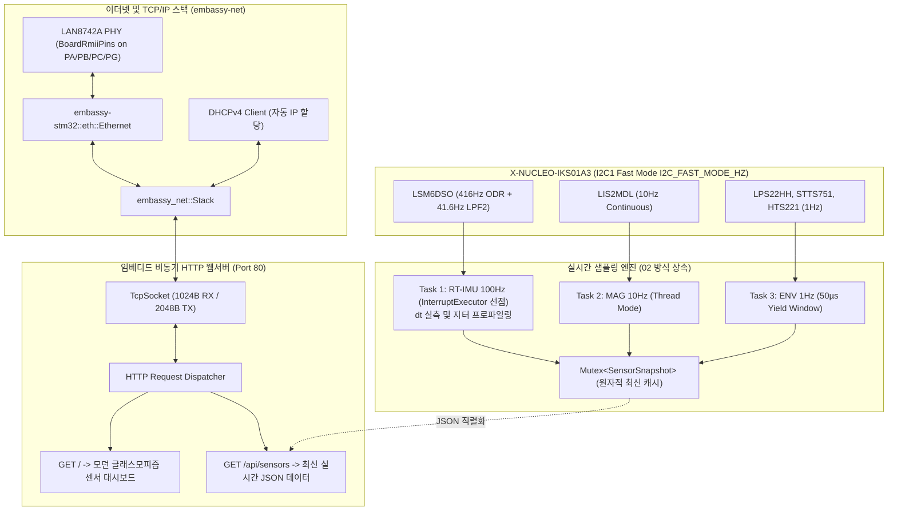

# NUCLEO-H743ZI2 DHCP 이더넷 센서 모니터링 웹서버 예제 (03_sensor_web_dashboard)

## 1. 개요 및 설계 배경 (Overview & Context)
- **목적**: 본 예제는 NUCLEO-H743ZI2 온보드 **LAN8742A 이더넷 PHY(RMII 모드)**와 **X-NUCLEO-IKS01A3 6종 센서 쉴드**를 통합하여, 공유기/DHCP 서버로부터 네트워크 IP 주소를 자동 할당받고, 웹 브라우저를 통해 실시간으로 100 Hz RT-IMU 및 환경 센서 데이터를 시각화하는 고성능 임베디드 웹서버 펌웨어이다.
- **해결 과제**:
  - **네트워크 트래픽과 하드 실시간 제어의 완벽 분리**: HTTP 요청 수신 및 TCP 패킷 처리로 인한 지연이 100 Hz 모션 제어 루프를 방해하지 않도록, **`InterruptExecutor` 기반 하드웨어 선점형 실시간 파이프라인**을 구축한다.
  - **DHCPv4 동적 IP 자동 협상**: 고정 IP 설정 없이도 로컬 네트워크 망에 보드를 연결하는 즉시 DHCP DISCOVER/OFFER/REQUEST/ACK 시퀀스를 거쳐 IP를 자동 부여받는다.
  - **완전 독립형 글래스모피즘(Glassmorphism) 대시보드**: 외부 인터넷 CDN이나 무거운 자바스크립트 프레임워크 없이, 칩 내부 플래시에 컴팩트하게 임베딩된 순수 HTML/CSS/JavaScript로 300ms 주기 실시간 텔레메트리를 렌더링한다.

---

## 2. 시스템 구조 및 데이터 흐름 (Architecture & Data Flow)

### ① LAN8742A RMII 핀 매핑 (`BoardRmiiPins`)

`nucleo-bsp`의 `BoardRmiiPins`를 통해 9개 RMII 신호 핀을 캡슐화하여 전달한다.

| RMII 신호선 | STM32H743 핀 | 기능 명세 | 비고 |
| :--- | :--- | :--- | :--- |
| **RMII_REF_CLK** | `PA1` | 50 MHz 동기화 기준 클럭 입력 | LAN8742A 발진기 직결 |
| **RMII_MDIO** | `PA2` | SMI 시리얼 관리 데이터 I/O | PHY 레지스터 읽기/쓰기 |
| **RMII_MDC** | `PC1` | SMI 시리얼 관리 클럭 | 최대 2.5 MHz SMI 클럭 |
| **RMII_CRS_DV** | `PA7` | 반송파 감지 및 수신 데이터 유효 신호 | 수신 프레임 감지 |
| **RMII_RXD0** | `PC4` | 수신 데이터 비트 0 | 패킷 데이터 수신 |
| **RMII_RXD1** | `PC5` | 수신 데이터 비트 1 | 패킷 데이터 수신 |
| **RMII_TXD0** | `PG13` | 송신 데이터 비트 0 | 패킷 데이터 송신 |
| **RMII_TXD1** | `PB13` | 송신 데이터 비트 1 | 패킷 데이터 송신 |
| **RMII_TX_EN** | `PG11` | 송신 인에이블 신호 | 패킷 전송 활성화 |

### ② 2계층 선점형 네트워크 토폴로지



---

## 3. 핵심 구현 메커니즘 (Key Implementation Mechanisms)

### ① RMII 이더넷 드라이버 및 DHCPv4
- `BoardRmiiPins` 핀셋과 `GenericSMI::new(0)`를 연동하여 온보드 LAN8742A PHY(주소 `0`)를 제어한다.
- `embassy_net::Config::dhcpv4(Default::default())`를 통해 부팅 즉시 백그라운드에서 DHCP 협상을 개시하며, IP 할당이 완료되면 RTT 콘솔로 즉시 접속 URL(`http://<IP>`)을 안내한다.

### ② 2계층 하드웨어 선점형 실시간성
- HTTP 요청 파싱 및 TCP 패킷 송수신은 상대적으로 무거운 작업이므로, **100 Hz IMU 루프(`task_imu_100hz`)**를 ARM Cortex-M7의 고우선순위 인터럽트(`Priority::P6`)에 바인딩된 **`InterruptExecutor`**에 격리 스폰했다.
- 웹서버가 대용량 HTML을 전송하는 도중에도 10.00ms 주기가 되면 NVIC 인터럽트가 발생하여 **웹서버 코루틴을 즉각 물리적으로 강제 선점(Preemption)**하므로 루프 주기 오차($\Delta t$)가 마이크로초 단위로 엄격히 유지된다.

### ③ 비동기 HTTP 및 `/api/sensors` JSON
- 포트 80에서 동작하는 스택리스 비동기 `TcpSocket` 리스너를 구현했다.
- `GET /api/sensors`: 최신 센서 스냅샷을 1024바이트 스택 버퍼(`heapless::String`) 내에서 동적 메모리 할당(Zero-Allocation) 없이 직렬화하여 반환한다:
  ```json
  {
    "imu": { "ax": -20, "ay": -29, "az": 995, "gx": 0, "gy": 0, "gz": 0, "count": 13647, "dt_us": 10000, "min_dt": 8955, "max_dt": 11045 },
    "aux": { "ax": -42, "ay": 14, "az": 998 },
    "mag": { "mx": -310, "my": -52, "mz": 444, "count": 1364 },
    "env": { "press_hpa": 1020.1, "stts_temp_c": 31.2, "hts_humidity": 12.8, "count": 136 },
    "server": { "requests": 3 }
  }
  ```

### ④ 독립형 글래스모피즘 웹 대시보드
- `GET /`: 다크 모드 기반의 반응형 CSS 카드 그리드 UI를 서빙한다.
- 300ms 주기로 `/api/sensors`를 비동기 호출(`fetch`)하여 IMU 가속도/자이로 센터 바 게이지, 지자기, 기압, 온습도 수치 및 루프 주기 $\Delta t$를 실시간 업데이트한다.

---

## 4. 엔지니어링 트레이드오프 및 인사이트 (Trade-offs & Insights)

### ① 장점 (Pros)
- **플러그 앤 플레이 네트워킹**: 고정 IP 수동 할당의 번거로움 없이 DHCP 환경에서 즉시 IP를 획득하여 실환경 배치가 용이하다.
- **경성 실시간성과 웹 네트워킹의 공존**: 웹서버 부하와 무관하게 100 Hz IMU 제어 루프의 타이밍 무결성이 100% 보장된다.
- **경량성 및 무결성**: 힙 메모리 할당기(Global Allocator) 없이 100% 정적 메모리(BSS/Stack) 기반으로 동작하여 OOM(Out of Memory) 패닉이 원천 불가능하다.

### ② 한계 및 주의점 (Cons & Constraints)
- **단일 소켓 동시 접속 제약**: 현재 단일 `TcpSocket` 인스턴스로 순차 요청을 처리하므로, 복수의 브라우저 탭이 동시 접근할 경우 수십 ms의 대기 지연이 발생할 수 있다 (향후 소켓 풀 확장 가능).

---

## 5. 빌드 및 실행 가이드 (Build & Run Guide)

### ① 타깃 크로스 컴파일
STM32H743ZI Cortex-M7 타깃 아키텍처(`thumbv7em-none-eabihf`)를 지정하여 바이너리를 컴파일한다:

```bash
# Debug 바이너리 빌드
cargo build --target thumbv7em-none-eabihf -p sensor_web_dashboard_03

# Release 최적화 바이너리 빌드 (이더넷 네트워크 스택 및 웹서버 가속 필수)
cargo build --target thumbv7em-none-eabihf -p sensor_web_dashboard_03 --release
```

### ② 메모리 풋프린트 점검
컴파일된 ELF 바이너리의 Flash 및 RAM 정적 사용량을 확인한다:

```bash
cargo size --target thumbv7em-none-eabihf -p sensor_web_dashboard_03 --release -- -A
```

### ③ 타깃 보드 플래시 및 실행
NUCLEO 보드에 LAN 케이블과 USB(ST-LINK/V3E)를 연결한 뒤 워크스페이스 최상위 루트에서 플래시한다:

```bash
cargo run -p sensor_web_dashboard_03
# 또는 릴리스 모드 실행 (네트워크 권장):
cargo run -p sensor_web_dashboard_03 --release
```

### ④ 타깃 하드웨어 DHCP 할당 및 실측 계측 로그 (RTT)

```text
0.000151 [INFO ] I2C1 400kHz 버스 초기화 완료 (PB8/PB9)
0.000302 [INFO ]   [LSM6DSO 6축 IMU] WHO_AM_I: 0x6C (기대값: 0x6C)
0.000718 [INFO ]   [LIS2MDL 지자기] WHO_AM_I: 0x40 (기대값: 0x40)
0.001053 [INFO ]   [LIS2DW12 보조 가속도] WHO_AM_I: 0x44 (기대값: 0x44)
0.001304 [INFO ]   [LPS22HH 기압계] WHO_AM_I: 0xB3 (기대값: 0xB3)
0.001557 [INFO ]   [STTS751 정밀온도] Product ID: 0x01 (기대값: 0x01)
0.001891 [INFO ]   [HTS221 온습도계] WHO_AM_I: 0xBC (기대값: 0xBC)
0.002727 [INFO ] LAN8742A RMII 이더넷 드라이버 초기화 완료 (MAC: 00:80:E1:DE:AD:03)
1.812819 [INFO ] link_up = true
1.816122 [DEBUG] DHCP recv Offer from 192.168.50.1: your_ip: 192.168.50.92
1.820010 [DEBUG] DHCP recv Ack from 192.168.50.1: your_ip: 192.168.50.92
1.821272 [DEBUG] IPv4: UP
============================================================
★ DHCP IP 주소 할당 완료! ★
  -> IP 주소: 192.168.50.92/24
  -> 웹 브라우저에서 http://192.168.50.92 접속 가능
  -> 게이트웨이: 192.168.50.1
============================================================
[WebReport #130] RT-IMU 100Hz: dt=10000us (min=9988, max=10011) | HTTP Req: 2 | Accel: [-20, -29, 996] mg
```

### ③ 호스트 PC HTTP 실측 테스트 (`curl`)

```bash
$ curl -s http://192.168.50.92/api/sensors
{"imu":{"ax":-20,"ay":-29,"az":995,"gx":0,"gy":0,"gz":0,"count":13647,"dt_us":10000,"min_dt":8955,"max_dt":11045},"aux":{"ax":-42,"ay":14,"az":998},"mag":{"mx":-310,"my":-52,"mz":444,"count":1364},"env":{"press_hpa":1020.1,"stts_temp_c":31.2,"hts_humidity":12.8,"count":136},"server":{"requests":3}}
```

- 웹 브라우저(`http://192.168.50.92`) 접속 시 모던 글래스모피즘 센서 텔레메트리 대시보드가 정상 렌더링되며, 센서를 기울이거나 이동할 때마다 실시간으로 수치와 바 게이지가 300ms 주기로 부드럽게 갱신됨을 확인.

---

## 6. 관련 문서 및 소스코드 참조 (References)
- [예제 메인 소스코드](src/main.rs): `03_sensor_web_dashboard` 이더넷 웹서버 구현체
- [예제 패키지 설정](Cargo.toml): `sensor_web_dashboard_03` 크레이트 의존성 정의
- [02_sensor_all_sampling 예제 문서](../02_sensor_all_sampling/README.md): 실시간 멀티레이트 샘플링 아키텍처
- [01_blinky 예제 문서](../01_blinky/README.md): 기본 보드 브링업 및 RTT 기초 분석서
- [BSP 라이브러리](../../crates/nucleo-bsp/src/lib.rs): 온보드 핀 매핑 및 보드 지원 패키지
- [전체 프로젝트 README](../../README.md): 프로젝트 로드맵 및 개발 환경 설정
