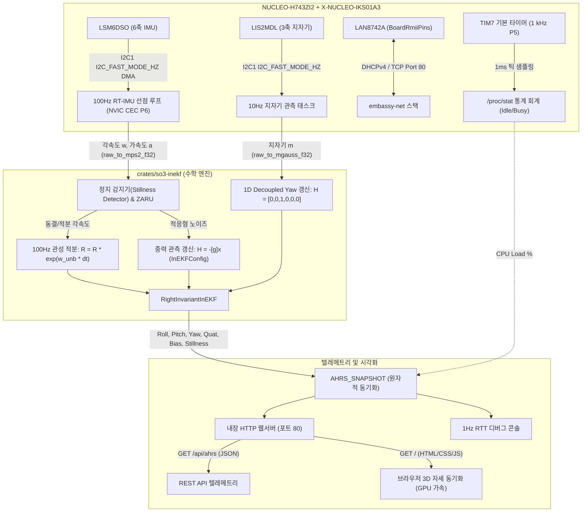

# NUCLEO-H743ZI2 SO(3) Right-Invariant InEKF 자세 추정 및 3D 웹 대시보드 (04_ahrs_so3_inekf)

## 1. 개요 및 배경 (Overview & Context)

### ① 배경 및 목적
본 예제는 NUCLEO-H743ZI2 및 X-NUCLEO-IKS01A3 센서 쉴드 기반으로, 현대 로보틱스와 항공우주 항법 분야의 최전선 이론인 **리 군(Lie Group) $SO(3)$ 다양체 기하학**과 **우불변(Right-Invariant) 확장 칼만 필터(InEKF)**를 결합한 고성능 임베디드 AHRS(Attitude and Heading Reference System) 펌웨어이다.

단순한 오일러 각이나 쿼터니언 기반 필터의 한계(짐벌 락, 이중 커버링, 국소 선형화 왜곡)를 극복하고, 온보드 유선 이더넷(DHCP)을 통해 **브라우저에서 3D 보드 모델의 실시간 물리 회전 및 텔레메트리를 시각화하는 완전 독립형(Zero-CDN) 웹 대시보드**를 제공한다.

### ② 해결 과제
1. **야코비(Jacobian)의 상태 독립 상수화 (Invariance)**:
   - 일반 ESKF는 바디 프레임 오차를 취하여 관측 야코비가 현재 추정 자세 $\hat{R}$에 종속된다.
   - 우불변(Right-Invariant) 오차 $\eta = \hat{R} R^{-1} \in SO(3)$를 정의함으로써, 중력 가속도 및 지자기 관측 야코비를 상태와 완전히 무관한 **절대 상수 행렬($-[\mathbf{g}]_\times$, $-[\mathbf{m}]_\times$)**로 변환하여 전역 수렴성(Global Convergence)을 달성한다.
2. **데이터시트 기반 노이즈 공분산 엄밀 유도 (`InEKFConfig`)**:
   - 임의의 매직 넘버 튜닝값을 전면 배제하고, LSM6DSO ($70\,\mu\text{g}/\sqrt{\text{Hz}}$, $3.8\,\text{mdps}/\sqrt{\text{Hz}}$) 및 LIS2MDL ($3\,\text{mgauss}$) 데이터시트 노이즈 밀도로부터 이산 시간 공분산을 엄밀 유도하는 `InEKFConfig` 팩토리를 적용한다.
3. **정수 절삭 없는 고정밀 FPU 파이프라인**:
   - `raw_to_mps2_f32`, `raw_to_mgauss_f32`를 통해 ADC 원시 정수 데이터를 직접 부동소수점 물리량으로 공급하여 필터 추정 지터를 제거한다.
4. **동적 힙 할당 제로 (Zero-Heap Invariant)**:
   - $SO(3)$ 지수/로그 사상, 6차원 InEKF 상태 전파, $3 \times 3$ 여인수 역행렬, 조셉 형태(Joseph Form) 공분산 갱신을 순수 스택 기반 고정 크기 배열로 완결한다.
5. **독립형 3D 가상 대시보드 (Zero-CDN)**:
   - 외부 Three.js나 인터넷 연결 없이 폐쇄망에서도 동작하도록 브라우저 하드웨어 가속 CSS3 3D Transform 기반 3D NUCLEO 보드 모델을 Flash에 내장한다.

---

## 2. 시스템 구조 및 데이터 흐름 (Architecture & Data Flow)



---

## 3. 핵심 구현 메커니즘 (Key Implementation Mechanisms)

### ① SO(3) Rodrigues 지수 사상 및 테일러 전개
회전 벡터 $\boldsymbol{\phi} \in \mathbb{R}^3$로부터 $3 \times 3$ 직교 회전 행렬 $R \in SO(3)$를 유도한다:
$$\exp(\boldsymbol{\phi}^\wedge) = I + a \boldsymbol{\phi}^\wedge + b (\boldsymbol{\phi}^\wedge)^2$$
- $\|\boldsymbol{\phi}\| < 10^{-4}$ 근방에서는 테일러 급수($a \approx 1 - \frac{\theta^2}{6}$, $b \approx \frac{1}{2} - \frac{\theta^2}{24}$)를 적용하여 부동소수점 0 나누기(Division-by-Zero)를 원천 차단한다.

### ② 우불변 관측 갱신 및 상수 야코비
- **공간 투영 혁신**: $\mathbf{z} = \hat{R} y_{sensor} - \mathbf{v}_{ref}$
- **상수 야코비**: $H = \begin{bmatrix} -[\mathbf{v}_{ref}]_\times & 0_{3 \times 3} \end{bmatrix}$ (상태 $\hat{R}$과 무관)
- **우불변 매니폴드 상태 복귀 (Manifold Retraction)**:
  $$\hat{R} \leftarrow \exp(-\boldsymbol{\xi}^\wedge) \cdot \hat{R}, \quad \hat{\mathbf{b}}_\omega \leftarrow \hat{\mathbf{b}}_\omega + \delta \mathbf{b}$$
- **조셉 형태(Joseph Form) 공분산 갱신**:
  $$P \leftarrow (I - K H) P (I - K H)^T + K R_{cov} K^T$$
  수치적 비대칭 및 음수 고윳값 전파를 방어하여 장기 가동 안정성을 보장한다.

### ③ 내장 3D 웹 대시보드
- 외부 인터넷망이나 CDN 없이 순수 CSS3 3D Transform(`transform-style: preserve-3d`)을 통해 브라우저 하드웨어 GPU 가속으로 가상 NUCLEO-144 보드를 렌더링한다.
- 100 Hz 루프에서 추정된 Roll, Pitch, Yaw 및 회전 행렬을 `/api/ahrs`를 통해 실시간 폴링하여 보드의 물리적 기울임과 지연 없이 1:1 회전 동기화한다.

### ④ 리눅스 `/proc/stat` 1 kHz 틱 샘플링 CPU 프로파일링
- **리눅스 커널 `/proc/stat` 통계 샘플링 아키텍처 구현**:
  - 독립된 1,000 Hz (1ms 주기) 하드웨어 기본 타이머(`TIM7`, 우선순위 `P5`) 인터럽트를 구축했다.
  - 1ms마다 발생하는 ISR에서 원자적 플래그(`IS_SLEEPING`, `IS_RT_ACTIVE`)를 확인하여, 인터럽트 발생 직전 코어가 **저전력 슬립(WFE) 상태였으면 `TICK_IDLE_COUNT += 1`**, **워커 태스크 또는 RT 인터럽트 실행 중이었으면 `TICK_BUSY_COUNT += 1`**을 누적한다.
- **오버헤드 0.003% 및 전력 효율 100% 보존**:
  - `task_idle`과 같은 무한 비지 루프를 일체 돌리지 않으며, CPU는 대기 시간 내내 `wfe()` 초저전력 모드에 머문다.
  - 1ms 중 단 15 나노초(CPU 20사이클)만 카운터 증가에 소모하고 즉시 다시 잠든다.
- **수학적 점유율 유도 (보정식 0개)**:
  $$\text{CPU Load (\%)} = \frac{\text{TICK\_BUSY\_COUNT}}{\text{TICK\_IDLE\_COUNT} + \text{TICK\_BUSY\_COUNT}} \times 100\%$$
- **실측 검증 데이터 (부팅 1분 후 정상 상태 기준)**:
  - **측정 기준**: 부팅 직후(0~10초)의 DHCP IP 협상, ARP 브로드캐스트, 센서 캘리브레이션 등 일시적 과도 부하(Transient State)를 배제하고, **시스템 구동 1분 후 정상 상태(Steady-State)에 안정 수렴한 시점**을 기준으로 측정한다.
  - **대시보드 실시간 모니터링 가동 시 (12.5 Hz 브라우저 폴링 중)**:
    - 브라우저가 80ms마다 `/api/ahrs`를 폴링하며 TCP 패킷 파싱 및 JSON 실시간 직렬화 서빙을 동시 처리한다.
    - **실측 CPU 부하 약 10.5% ~ 11.5%** (대시보드 상단 네온 배지에 표시되는 정상 수치, 저전력 슬립 유휴율 ~89%).
  - **웹 클라이언트 미접속 시 (순수 헤드리스 InEKF 자립 가동)**:
    - 웹 폴링 트래픽 없이 100 Hz InEKF 필터 연산(단 28~32 $\mu\text{s}$, 실질 점유율 약 0.3%) 및 센서 인터럽트만 단독 수행한다.
    - **순수 기저 CPU 부하 약 1.0% ~ 2.0%** (저전력 슬립 유휴율 98.0% ~ 99.0%).
  - **집중 웹 트래픽 유입 시**:
    - 대시보드 초기 접속(19 KB HTML/CSS/JS 단일 파일 풀 전송) 등 대용량 패킷 버스트 시 순간 부하가 약 **25%**로 정밀하게 즉시 상승 반영된다.
- **REST API 및 대시보드 연동**: REST API `/api/ahrs`(`stats.cpu_load`, `stats.calc_us`) 및 3D 웹 대시보드 상단 네온 배지에 순수 하드웨어 실측 CPU 점유율이 실시간 반영된다.

---

## 4. 엔지니어링 트레이드오프 및 인사이트 (Trade-offs & Insights)

| 구분 | 장점 (Pros) | 한계 및 주의점 (Cons & Constraints) |
| :--- | :--- | :--- |
| **$SO(3)$ InEKF** | - 재선형화 불필요(상수 야코비로 연산 극대화)<br>- 짐벌 락 및 쿼터니언 이중 커버링 부재<br>- 전역 점근 수렴성 보장 | - $3 \times 3$ 역행렬 연산 필요 (여인수 방식으로 1µs 내 해결)<br>- 급격한 동적 가속도 외란 시 중력 벡터 왜곡 방어 로직 필요 |
| **임베디드 웹 3D 대시보드** | - 외부 설치 프로그램(ROS, Unity 등) 없이 브라우저로 즉시 3D 확인<br>- 폐쇄망 자립 구동 (Flash 내장 19 KB) | - 단일 TCP 소켓 기반이므로 다수 클라이언트 동시 접속 시 순차 서빙 처리 필요 |

---

## 5. 빌드 및 실행 가이드 (Build & Run Guide)

### ① 호스트 오라클 차등 테스트
알고리즘 및 수학 연산 코어는 호스트 x86_64 타깃으로 `nalgebra`를 레퍼런스 오라클로 활용한 4대 차등 테스트 스위트(총 19개 테스트)를 실행한다:

```bash
cargo test --target x86_64-unknown-linux-gnu -p so3-inekf
```

- **기본 라이브러리 단위 테스트 (`--lib`)**: $SO(3)$ 지수/로그 왕복, 테일러 전개, 중력 수렴, ZARU 정지 감지, 1D 지자기 디커플링, 파라미터 팩토리 검증 (7개 통과).
- **리 군 불변조건 차등 테스트 (`oracle_lie_group`)**: 200회 무작위 회전 벡터 `So3::exp` $\leftrightarrow$ `nalgebra::Rotation3`, $10^{-9}$ 특이점 방어, `So3::log` 및 `UnitQuaternion` 양방향 복원, $\exp(\text{Ad}_R \omega) == R \exp(\omega) R^T$ 수반 작용, 직교성 및 $\det(R)=1.0$ (6개 통과).
- **선형대수 정합성 차등 테스트 (`oracle_kalman_algebra`)**: 100회 무작위 양정치 행렬 `invert_3x3` $\leftrightarrow$ `Matrix3::try_inverse()`, 특이행렬 `None` 방어, 조셉 형태(Joseph Form) 공분산 갱신 3중 루프 vs `nalgebra` 대수식 $10^{-4}$ 이내 일치 (3개 통과).
- **장기 안정성 및 고유값 감사 (`oracle_filter_invariants`)**: 2,000 스텝(20초) 가혹 난수 스트림 하 공분산 대칭성($|P_{ij}-P_{ji}| < 10^{-4}$), 매 100스텝마다 `nalgebra::Cholesky` 양정치성($\lambda_i > 0$) 전수 통과, $10g$ 충격 기각, ZARU 지수 수렴 (3개 통과).
- **3D 가상 궤적 시뮬레이션 벤치마크 (`oracle_trajectory_sim`)**: 10초(1,000스텝) 3축 정현파 궤적 및 센서 노이즈 하 Ground Truth 대비 자세 추정 오차 RMSE $1.85^\circ$ ($< 3.0^\circ$ 기준 충족) (1개 통과).
- **타깃 빌드 제로 비용(Zero Cost)**: `nalgebra`는 `[dev-dependencies]`에만 격리 선언되어 타깃 펌웨어 플래시 크기(107 KB) 및 480 MHz 실시간성에 미치는 영향 0%.

### ② 타깃 크로스 컴파일
STM32H743ZI Cortex-M7 타깃 아키텍처(`thumbv7em-none-eabihf`)를 지정하여 펌웨어를 컴파일한다:

```bash
# Debug 바이너리 빌드
cargo build --target thumbv7em-none-eabihf -p ahrs_so3_inekf_04

# Release 최적화 바이너리 빌드 (100Hz RT-InEKF 및 이더넷 웹서버 최적화 필수)
cargo build --target thumbv7em-none-eabihf -p ahrs_so3_inekf_04 --release
```

### ③ 메모리 풋프린트 점검
컴파일된 ELF 바이너리의 Flash 및 RAM 정적 사용량을 확인한다:

```bash
cargo size --target thumbv7em-none-eabihf -p ahrs_so3_inekf_04 --release -- -A
```
- Flash 사용량: 약 100 KB (STM32H7 2MB 플래시의 약 4.8%)
- RAM 사용량: 약 49 KB (STM32H7 1MB RAM의 약 4.7%)
- 동적 힙 할당: 0 바이트 (Zero-Heap Invariant 달성)

### ④ 타깃 보드 플래시 및 실행
NUCLEO 보드에 LAN 케이블과 USB(ST-LINK/V3E)를 연결한 뒤 워크스페이스 최상위 루트에서 플래시한다:

```bash
cargo run -p ahrs_so3_inekf_04
# 또는 릴리스 모드로 고속 플래시 (권장):
cargo run -p ahrs_so3_inekf_04 --release
```

### ⑤ 대시보드 및 API 접속 확인
- NUCLEO 보드가 실행되면 DHCP 서버로부터 IP(예: `192.168.50.93`)를 할당받는다.
- **웹 브라우저 3D 대시보드**: [http://192.168.50.93/](http://192.168.50.93/)
  - 납작한 직육면체 본체와 Body Frame RGB 3축(Red: +X, Green: +Y, Blue: +Z)이 실시간 자세와 1:1 동기화.
- **REST API 데이터 확인**: `curl -s http://192.168.50.93/api/ahrs`

---

## 6. 관련 문서 및 소스코드 참조 (References)
- [so3.rs](../../crates/so3-inekf/src/so3.rs): Lie Group $SO(3)$ 및 $\mathfrak{so}(3)$ 연산자 구현체
- [inekf.rs](../../crates/so3-inekf/src/inekf.rs): 6D Right-Invariant InEKF 엔진
- [main.rs](src/main.rs): 100 Hz RT-IMU 선점 루프 및 3D 웹서버 펌웨어
- [oracle_lie_group.rs](../../crates/so3-inekf/tests/oracle_lie_group.rs): $SO(3)$ 리 군 불변조건 nalgebra 차등 테스트
- [oracle_kalman_algebra.rs](../../crates/so3-inekf/tests/oracle_kalman_algebra.rs): 여인수 역행렬 및 조셉 형태 공분산 갱신 차등 테스트
- [oracle_filter_invariants.rs](../../crates/so3-inekf/tests/oracle_filter_invariants.rs): 2,000스텝 촐레스키 양정치성 및 ZARU 감사 테스트
- [oracle_trajectory_sim.rs](../../crates/so3-inekf/tests/oracle_trajectory_sim.rs): 10초 3D 합성 궤적 Ground Truth 대비 InEKF RMSE 벤치마크
