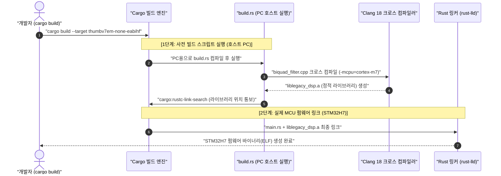

# NUCLEO-H743ZI2 Mixed Language (Rust + Legacy C++) 예제 (05_mixed_cpp_legacy)

## 1. 개요 및 설계 배경 (Overview & Context)

### ① 도입 배경
항공, 로봇, 제어 도메인에는 수치적 정합성과 안정성이 기검증된 C/C++ 기반 DSP 알고리즘 및 수학 모델 자산이 광범위하게 운용된다. 이를 Rust로 전면 재작성(Full Rewrite)하는 방식은 막대한 재검증 비용 및 회귀 결함 위험을 수반한다. 따라서 기존 C++ 소스코드를 원형 그대로 보존하면서 신규 Rust 펌웨어 아키텍처에 무오버헤드로 통합하는 Mixed Language 연동 규격이 요구된다.

### ② 시스템 목표
NUCLEO-H743ZI2 (Arm® Cortex®-M7 480 MHz) 개발 보드 및 X-NUCLEO-IKS01A3 센서 쉴드 환경에서, 기존 C++ 2차 IIR Biquad 저주파 통과 필터(LPF) 클래스를 Rust 빌드 파이프라인(`build.rs` + `cc` + `clang++-18`)을 통해 크로스 컴파일하고, Embassy 비동기 런타임에서 안전하게 실시간 호출하는 표준 참조 아키텍처를 제시한다.

---

## 2. 시스템 구조 및 데이터 흐름 (Architecture & Data Flow)

```mermaid
flowchart TD
    subgraph BuildTime["빌드 타임 파이프라인 (Cargo + build.rs)"]
        A["cargo build --target thumbv7em-none-eabihf"] --> B["build.rs 실행"]
        B --> C["cc::Build 크로스 컴파일러 호출"]
        C -->|"clang++-18 / -mcpu=cortex-m7 / -fno-exceptions / -fno-rtti"| D["cpp/src/biquad_filter.cpp"]
        D --> E["liblegacy_dsp.a (정적 아카이브)"]
        E -->|"rust-lld 정적 링크 (cpp_link_stdlib: None)"| F["mixed_cpp_legacy_05 ELF 바이너리"]
    end

    subgraph Runtime["런타임 실행 흐름 (100 Hz RT 센서 루프)"]
        G["IKS01A3 LSM6DSO 6축 IMU"] -->|"I2C1 I2C_FAST_MODE_HZ DMA"| H["Embassy 비동기 루프 (SAMPLING_RATE_HZ)"]
        H -->|"원시 가속도 데이터 (mg)"| I["SafeBiquadFilter (Rust RAII 래퍼)"]
        I -->|"extern C FFI 무오버헤드 호출"| J["C++ BiquadFilter::process (Direct Form II Transposed)"]
        J -->|"평활화된 가속도 출력 (mg)"| K["defmt / RTT 실시간 로깅 및 LED 하트비트"]
    end
```



---

## 3. 핵심 구현 메커니즘 (Key Implementation Mechanisms)

### ① Clang 18 크로스 컴파일 파이프라인 (`build.rs`)
- **LLVM 통합 크로스 컴파일**: 호스트 시스템의 `clang++-18`을 호출하여 타깃 아키텍처(`thumbv7em-none-eabihf`, Cortex-M7 Hard-float `fpv5-d16`)로 C++ 소스코드를 컴파일하고 정적 아카이브(`liblegacy_dsp.a`)를 생성한다.
- **임베디드 C++ 런타임 제거 (`no_std` 호환)**:
  - `-fno-exceptions`: 예외 처리 테이블(`__gxx_personality_v0`) 및 DWARF 언와인딩 정보를 제거한다.
  - `-fno-rtti`: 런타임 타입 정보(`typeid`) 및 가상 함수 테이블 오버헤드를 제거한다.
  - `-fno-unwind-tables`: 불필요한 언와인딩 프레임 생성을 억제한다.
  - `build.cpp_link_stdlib(None)`: 호스트 C++ 표준 라이브러리(`-lstdc++`) 링크를 차단하여 순수 자립형(Freestanding) 링크를 보장한다.

### ② 무할당(Zero-Allocation) C++ 클래스 및 C-ABI 브리지 (`cpp/`)
- **Direct Form II Transposed 구조**: 부동소수점 누적 오차 및 레지스터 오버플로우 저항성을 확보한 2차 IIR Biquad LPF를 구현한다.
- **자립형 삼각함수 다항식 근사**: 외부 `libm` 심볼 의존성을 배제하기 위해 7차 테일러/미니맥스 고정밀 다항식 근사(`local_sinf`, `local_cosf`)를 C++ 내부에 직접 구현한다.
- **Placement 초기화 C-ABI 브리지**:
  ```cpp
  uint32_t biquad_get_instance_size(void);
  void biquad_init_lpf(void* filter_mem, float sample_rate, float cutoff_freq, float q);
  float biquad_process(void* filter_mem, float input);
  void biquad_reset(void* filter_mem);
  ```
  동적 힙 할당(`malloc`/`new`)을 배제하고, Rust에서 전달받은 스택 메모리 공간에 C++ 객체를 직접 초기화한다.

### ③ Safe RAII Rust Newtype 래퍼 및 SSOT 상수 결합
- **스택 인라인 저장소**: C++ `sizeof(BiquadFilter)`가 28바이트(float 7개)임을 반영하여, Rust 측에서 4바이트 정렬된 32바이트 인라인 버퍼 `[u8; 32]`를 소유한다.
- **단일 진실 공급원(SSOT) 상수 바인딩**:
  - `SAMPLING_RATE_HZ = 100`: Embassy `Ticker::every(Duration::from_hz(SAMPLING_RATE_HZ))`와 `SafeBiquadFilter::new_lpf(SAMPLING_RATE_HZ as f32, ...)`가 단일 상수를 공유하여 샘플링 주기 불일치 오차를 방지한다.
  - `FILTER_CUTOFF_HZ = 5.0`: Butterworth 5Hz 차단 주파수를 명시적으로 선언한다.
  - `I2C_FAST_MODE_HZ`: BSP 400kHz I2C 클럭을 사용한다.
- **RAII 메모리 수명주기 보장**:
  ```rust
  #[repr(C, align(4))]
  pub struct SafeBiquadFilter {
      storage: [u8; 32],
  }
  ```
  포인터를 비즈니스 로직에 노출하지 않고 Rust Safe API(`new_lpf`, `process`, `reset`)만을 제공하며, `Drop` 트레이트를 통해 소멸 시 내부 상태를 안전하게 초기화한다.

---

## 4. 빌드 시스템 패러다임: Makefile/CMake vs build.rs

### ① 전통적 빌드 모델과의 차이점
전통적 C/C++ 생태계에서는 빌드 명세(Makefile, CMakeLists.txt)와 소스코드(*.c, *.cpp)를 엄격히 분리하는 선언적(Declarative) 방식을 표준으로 유지해 왔다. 반면 Rust는 패키지 루트의 `build.rs` 스크립트를 통해 빌드 전처리 과정을 튜링 완전한 명령형(Imperative) Rust 코드로 직접 제어하는 방식을 표준 규격으로 채택한다.

### ② 단일 툴체인 완결성
복수 언어가 혼합된 프로젝트에서 외부 빌드 도구(Make, CMake, Ninja)에 대한 추가 의존성을 제거하고, 오직 `cargo build` 명령어 단일 진입점만으로 의존성 해결, 소스코드 컴파일, 정적 링크를 완결하도록 설계된 메커니즘이다.

### ③ Makefile/CMake vs build.rs 비교

| 비교 항목 | C/C++ 전통 방식 (Makefile / CMake) | Rust 방식 (`build.rs` + `cc` 크레이트) |
| :--- | :--- | :--- |
| **빌드 실행 흐름** | `cmake` ➔ `make` ➔ `cargo` (다단계 수동 실행) | **`cargo build` 단일 명령으로 C++ 컴파일 및 최종 링크 완결** |
| **호스트 도구 의존성** | `make`, `cmake`, `ninja`, `python` 등 별도 설치 필수 | Rust 패키지 매니저(`cargo`) 단일 도구로 완결 |
| **타깃 파라미터 동기화** | Cargo 타깃과 Makefile 플래그 간 수동 동기화 필요 (오차 위험) | Cargo의 `TARGET`, `OPT_LEVEL`, `OUT_DIR` 환경변수를 자동 상속 |
| **플랫폼 일관성** | OS 환경(Linux `make`, Windows `nmake`/`mingw`)별 문법 파편화 | 호스트 OS에 독립적인 표준 Rust API로 일관된 제어 |

### ④ 2단계 크로스 컴파일 라이프사이클

Cargo는 프로젝트 루트에 `build.rs`가 정의된 경우 개발 호스트 PC에서 `build.rs`를 우선 실행한 뒤, 산출된 정적 라이브러리를 MCU 타깃 링크 단계에 결합한다:



### ⑤ 생태계 적용 사례 및 확장 전략
- **표준 라이브러리 채택 사례**: `ring`(C/어셈블리 암호화 루틴), `openssl-sys`, `libsqlite3-sys`, `zstd-sys`, 임베디드 벤더 PAC 등 C/C++ 소스코드를 내장한 주요 Rust 크레이트 전반이 `build.rs` + `cc` 방식을 채택하고 있다.
- **CMake 기반 대규모 레거시 프로젝트 확장**:
  수백 개의 소스 파일과 복잡한 계층 구조를 갖는 기존 C++ 프로젝트의 경우 `cmake` 크레이트를 활용할 수 있다. `build.rs` 내부에서 `cmake::build("legacy_cpp_dir")`를 호출하면, Cargo가 기존 `CMakeLists.txt` 빌드를 백그라운드에서 구동하고 산출된 정적 아카이브를 자동으로 링커에 전달한다.

---

## 5. no_std 환경 C++ FFI 메모리 안전성

### ① C++ 힙 할당 배제 및 스택 인라인 배치
- **동적 할당 링커 결함 방어**: 베어메탈 마이크로컨트롤러 환경에는 기본 C/C++ 런타임의 동적 힙 알로케이터가 구현되어 있지 않거나 정적 메모리 정책을 강제한다. C++ 소스에서 `new`를 호출할 경우 링커 단계에서 `malloc` 미정의 참조 에러가 발생하거나 런타임 힙 단편화가 초래된다.
- **스택 인라인 저장소(Inline Storage) 기법**:
  C++ 클래스의 메모리 크기(float 7개 = 28바이트)를 측정하여, Rust 측에서 4바이트 정렬된 32바이트 스택 버퍼(`[u8; 32]`)를 할당하고 포인터를 전달해 객체를 초기화(Placement 방식)한다. 이를 통해 동적 힙 메모리 할당을 완전히 배제하고 실시간 결정론(Deterministic Real-Time)을 확보한다.

### ② C++ 예외 및 RTTI 제거
- **예외 전파 불가(No Exception Crossing)**: C++의 예외 메커니즘(`throw`/`catch`)은 스택 언와인딩 테이블(`eh_frame`)과 C++ 런타임 지원을 필요로 한다. FFI 경계를 넘어 Rust로 예외가 전파될 경우 Rust 런타임은 이를 포착할 수 없어 미정의 동작(Undefined Behavior) 및 시스템 정지가 발생한다.
- **컴파일 플래그 강제**: 임베디드 C++ 컴파일 시 `-fno-exceptions`, `-fno-rtti`, `-fno-unwind-tables` 플래그를 강제하여 예외 프레임 생성을 배제하고 바이너리 풋프린트를 최소화한다.

### ③ extern "C" ABI 및 맹글링 방어
- C++ 컴파일러는 함수 오버로딩과 네임스페이스를 지원하기 위해 심볼 이름을 내부적으로 변환(Name Mangling, 예: `_ZN12BiquadFilter7processEf`)한다.
- Rust 링커가 C++ 함수 심볼을 정확히 해석할 수 있도록, 모든 FFI 브리지 함수는 `extern "C"` 블록으로 감싸 순수 C-ABI 심볼(`biquad_process`)로 노출해야 한다.

---

## 6. 엔지니어링 트레이드오프 및 인사이트 (Trade-offs & Insights)

| 구분 | 장점 (Pros) | 한계 및 주의점 (Cons & Constraints) |
| :--- | :--- | :--- |
| **Mixed Language FFI** | - 기검증된 레거시 C++ 알고리즘 자산 재활용<br>- 알고리즘 재작성에 따른 검증 리스크 제거<br>- 직접 분기(Branch) 인스트럭션 기반 호출로 FFI 오버헤드 부재 | - `unsafe` 블록 경계 관리 필요<br>- C++ 예외 전파 불가에 따른 방어적 설계 필수 |
| **Zero-Allocation 스택 방식** | - 힙 단편화 및 메모리 누수 위험 원천 배제<br>- 실시간 결정론(Deterministic Real-Time) 보장 | - C++ 클래스 크기 변경 시 Rust 인라인 버퍼 크기 재검증 필요 |
| **Clang 18 크로스 컴파일** | - GCC 별도 설치 없이 LLVM 단일 파이프라인 유지<br>- `-O3` 고도 벡터화 최적화 활용 | - 호스트 시스템의 Clang 툴체인 버전 의존성 |

---

## 7. 빌드 및 실행 가이드 (Build & Run Guide)

### ① 타깃 릴리스 빌드
STM32H743ZI Cortex-M7 타깃 아키텍처(`thumbv7em-none-eabihf`)를 지정하여 펌웨어를 컴파일한다:

```bash
cargo build --target thumbv7em-none-eabihf -p mixed_cpp_legacy_05 --release
```

### ② 메모리 풋프린트 점검
```bash
cargo size --target thumbv7em-none-eabihf -p mixed_cpp_legacy_05 --release -- -A
```
- **Flash (`.text` + `.rodata`)**: 약 **28.0 KB** (C++ 클래스 및 FFI 포함)
- **RAM (`.data` + `.bss`)**: 약 **33.4 KB**

### ③ 타깃 보드 플래시 및 실행
`.cargo/config.toml`에 설정된 Runner를 통해 빌드, 플래시, RTT 수신을 원클릭으로 실행한다:

```bash
# Debug 바이너리 빌드 및 플래시 실행
cargo run -p mixed_cpp_legacy_05

# Release 최적화 바이너리 빌드 및 플래시 실행 (권장)
cargo run -p mixed_cpp_legacy_05 --release
```

**실측 출력 예시 (100 Hz 센서 루프)**:
```text
0.000021 [INFO ] I2C1 버스 400kHz 초기화 완료 (PB8/PB9)
0.000255 [INFO ] LSM6DSO WHO_AM_I: 0x6C (기대값: 0x6C)
0.000531 [INFO ] LSM6DSO 416Hz ODR 하드웨어 가속도계 가동 완료
0.000582 [INFO ] C++ BiquadFilter 3축(X, Y, Z) 인스턴스 초기화 완료 (Fs=100Hz, Fc=5Hz)
1.000958 [INFO ] [100Hz #100] RAW: [-158.112, -26.535, 983.32] mg | C++ LPF: [-157.77437, -28.64144, 984.4204] mg
2.000958 [INFO ] [100Hz #200] RAW: [-157.746, -27.206, 984.052] mg | C++ LPF: [-157.90004, -28.286167, 984.0669] mg
3.000958 [INFO ] [100Hz #300] RAW: [-156.709, -27.267, 984.357] mg | C++ LPF: [-158.18208, -28.432854, 983.98456] mg
```
LSM6DSO 가속도계 원시 데이터의 고주파 노이즈가 C++ 2차 저주파 통과 필터(LPF) 연산을 통해 실시간 평활화(Filtering)됨을 확인할 수 있다.
