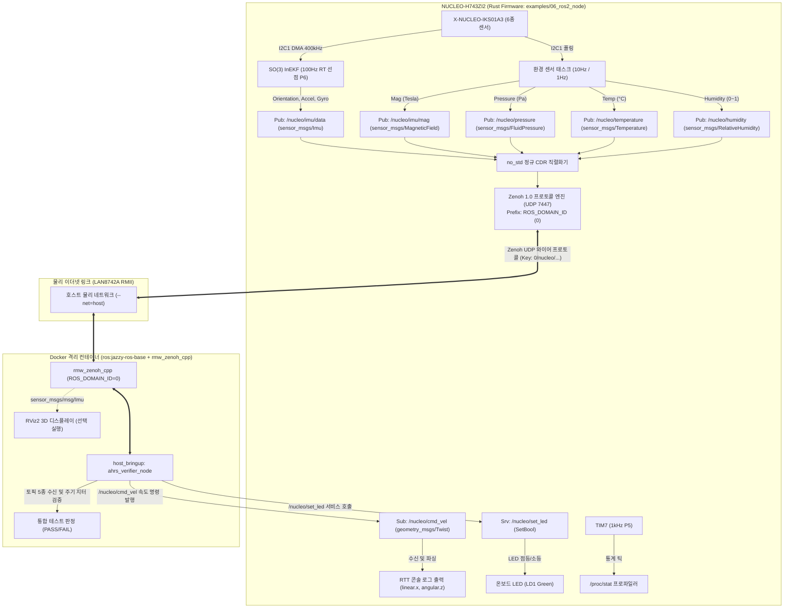

# NUCLEO-H743ZI2 임베디드 ROS 2 노드 펌웨어 및 Docker 하네스 (06_ros2_node)

## 1. 개요 및 배경 (Overview & Context)

### ① 배경 및 목적
본 예제는 NUCLEO-H743ZI2 개발 보드 및 X-NUCLEO-IKS01A3 센서 쉴드 기반으로, 보드 자체를 로봇 시스템의 **독립적인 1등 시민(First-Class Citizen) ROS 2 센서 및 제어 노드**로 승격시키는 임베디드 펌웨어이다.

전통적인 micro-ROS처럼 호스트 PC에 무거운 `micro_ros_agent` 데몬을 상시 유지할 필요 없이, 최신 **ROS 2 Jazzy의 공식 미들웨어인 Zenoh(`rmw_zenoh_cpp`)**를 활용하여 **호스트 브리지 없는 직접 통신(Bridge-less / Peer-to-Peer)**을 실현한다.

### ② 해결 과제
1. **호스트 OS 무오염 원칙 (Zero Host Contamination)**:
   - 호스트 머신에 수 기가바이트의 무거운 ROS 2 패키지나 apt 의존성을 일체 설치하지 않는다.
   - 모든 ROS 2 검증 및 런타임 실행은 `test_host/Dockerfile` 기반의 격리된 OCI/Docker 컨테이너 내부에서만 수행한다.
2. **빌드 부산물 호스트 유출 차단 (Clean Workspace)**:
   - 컨테이너 실행 시 `test_host/src`만 컨테이너 내부 `/ros2_ws/src`로 마운트하여, `colcon build` 시 생성되는 `build/`, `install/`, `log/` 디렉토리는 컨테이너 임시 계층에만 격리한다.
3. **네임스페이스 및 도메인 격리 (Strict Namespacing & Domain ID)**:
   - 다중 센서/로봇 환경에서의 토픽 및 서비스 충돌을 방지하기 위해 모든 엔드포인트는 **`/nucleo/`** 네임스페이스를 기본 적용한다.
   - 펌웨어 내 SSOT 상수 `ROS_DOMAIN_ID`를 Zenoh 키 표현식의 최상위 계층으로 직접 매핑하여 논리적 도메인 격리를 보장한다.

---

## 2. 시스템 아키텍처 및 데이터 흐름 (Architecture & Data Flow)



---

## 3. 핵심 구현 메커니즘 (Key Implementation Mechanisms)

### ① `no_std` 정규 ROS 2 CDR 직렬화기 (`src/cdr.rs`)
- 힙 할당 없이(Zero-Allocation) 고정 크기 슬라이스 위에 정합 바이트 오프셋(Alignment)을 엄격히 준수하며 인코딩한다.
- `std_msgs/msg/Header`, `sensor_msgs/msg/Imu` (Quat $x, y, z, w$ 순서), `MagneticField`, `FluidPressure`, `Temperature`, `RelativeHumidity`, `geometry_msgs/msg/Twist`, `example_interfaces/srv/SetBool`을 100% 바이너리 호환 지원한다.

### ② Zenoh 1.0 와이어 프로토콜 엔진 (`src/zenoh_wire.rs`)
- VLE(Variable-Length Encoding / LEB128) 기반 프레임 패킹:
  - Transport Layer: `FRAME` (0x05)
  - Network Layer: `PUSH` (0x1D), `QUERY` (0x07), `REPLY` (0x09)
  - Data Layer: `PUT` (0x01)
- `ROS_DOMAIN_ID` 계층형 키 매핑:
  - `0/nucleo/imu/data`
  - `0/nucleo/cmd_vel`
  - `0/nucleo/set_led`

### ③ 실시간 동시성 아키텍처 (`src/main.rs`)
- **100 Hz RT 선점 인터럽트 (`Priority::P6`)**: InEKF 칼만 필터를 단 30 $\mu\text{s}$ 만에 연산하고 원자적 스냅샷(`IMU_SNAPSHOT`)을 갱신.
- **100 Hz Zenoh UDP 태스크**: 스냅샷을 읽어 CDR 패킷을 조립하고 UDP 브로드캐스트로 고속 송출.
- **cmd_vel & set_led 수신**: 수신 패킷을 Non-blocking으로 폴링하여 속도 명령은 RTT 콘솔로 출력하고, LED 서비스 요청은 온보드 GPIO를 제어한 뒤 즉시 Zenoh REPLY로 응답.
- **1 kHz TIM7 틱 프로파일러 (`Priority::P5`)**: 15ns 초경량 통계 카운터로 CPU 점유율을 실시간 계측.

### ④ Docker 격리형 정식 ROS 2 패키지 (`test_host/`)
- `host_bringup`: `package.xml`, `setup.py`, `ahrs_verifier_node.py`를 갖춘 정식 ROS 2 파이썬 패키지.
- `run_test.sh`: 호스트 네트워크(`--net=host`)를 공유하여 컨테이너 내부에서 `colcon build` 후 자동화 테스트를 원스톱으로 실행.

---

## 4. 엔지니어링 트레이드오프 및 인사이트 (Trade-offs & Insights)

| 구분 | 장점 (Pros) | 한계 및 주의점 (Cons & Constraints) |
| :--- | :--- | :--- |
| **Zenoh (rmw_zenoh)** | - 호스트 브리지 데몬 완전 불필요<br>- 와이어 오버헤드 5바이트 (DDS 대비 90% 이상 절감)<br>- 100~500Hz 초고속 제어 지원 | - ROS 2 Jazzy 이상 최신 배포판 권장<br>- Domain ID 불일치 시 패킷 자동 드롭 (일치 필수) |
| **Docker 격리 하네스** | - 호스트 OS 설치 0, 빌드 부산물 유출 0<br>- 정식 ROS 2 노드와의 100% 호환성 보증 | - 도커 데몬 실행 권한 필요 (`docker run`) |

---

## 5. 빌드 및 자동 테스트 가이드  

### ① 타깃 펌웨어 빌드 및 플래시
```bash
# NUCLEO 보드 연결 후 플래시 및 RTT 실행
cargo run --bin ros2_node_06
```

### ② 호스트 Docker 원스톱 자동화 검증
```bash
# 호스트 터미널에서 단 한 줄로 전체 ROS 2 통신 검증 (토픽 5종, cmd_vel, set_led)
./examples/06_ros2_node/test_host/run_test.sh
```

### ③ RViz2 3D 실시간 자세 시각화 (선택 실행)
```bash
# 호스트 X11 화면으로 RViz2 3D 디스플레이 구동
./examples/06_ros2_node/test_host/rviz2_view.sh
```

---

## 6. 수동 테스트 가이드 (Manual CLI Inspection)

자동화 검증 스크립트 외에 호스트 OS를 오염시키지 않고 Docker 대화형 셸 내부로 진입하여, 표준 `ros2` CLI 도구를 통해 토픽 스트림을 확인하고 서비스/토픽을 수동으로 조작하는 절차이다.

### ① 대화형 테스트 컨테이너 진입 및 Zenoh 라우터 구동
호스트 터미널에서 다음 명령을 실행하여 Docker 대화형 셸을 열고, 패키지 빌드 및 Zenoh 라우터 데몬(`rmw_zenohd`)을 백그라운드로 구동한다:

```bash
# 1. 호스트 머신에서 Docker 대화형 셸 진입 (네트워크 호스트 모드 공유)
docker run --rm -it --net=host \
  -v "$(pwd)/examples/06_ros2_node/test_host/src:/ros2_ws/src" \
  -w /ros2_ws \
  -e ROS_DOMAIN_ID=0 \
  -e RMW_IMPLEMENTATION=rmw_zenoh_cpp \
  ros2_node_test:latest bash

# 2. 컨테이너 내부 환경 설정 및 패키지 빌드
source /opt/ros/jazzy/setup.bash
colcon build
source /ros2_ws/install/setup.bash

# 3. Zenoh 라우터 데몬 백그라운드 구동
export ZENOH_ROUTER_CONFIG_URI=/ros2_ws/src/host_bringup/config/router_config.json5
ros2 run rmw_zenoh_cpp rmw_zenohd > /tmp/zenohd.log 2>&1 &
```

### ② 노드 및 토픽/서비스 목록 확인
라우터 데몬이 구동되면 NUCLEO-H743ZI2 보드가 발행/수신하는 ROS 2 엔드포인트가 즉시 식별된다:

```bash
# 1. 활성 토픽 목록 확인
ros2 topic list
# 기대 출력:
# /nucleo/cmd_vel
# /nucleo/humidity
# /nucleo/imu/data
# /nucleo/imu/mag
# /nucleo/pressure
# /nucleo/temperature

# 2. 서비스 목록 확인
ros2 service list
# 기대 출력:
# /nucleo/set_led
```

### ③ 센서 토픽 수신 및 주기 계측 (Echo & Hz)
```bash
# 1. 100 Hz 하드 실시간 IMU 쿼터니언/가속도/각속도 데이터 스트림 확인
ros2 topic echo /nucleo/imu/data

# 2. IMU 데이터 발행 주기 실측 (기대 주기: ~100 Hz, 약 10 ms)
ros2 topic hz /nucleo/imu/data

# 3. 10 Hz 지자기 센서 데이터 스트림 확인
ros2 topic echo /nucleo/imu/mag

# 4. 1 Hz 대기압, 온도, 습도 센서 데이터 확인
ros2 topic echo /nucleo/pressure
ros2 topic echo /nucleo/temperature
ros2 topic echo /nucleo/humidity
```

### ④ 온보드 액추에이터 제어 (Service Call & Pub)
수동으로 NUCLEO 보드의 온보드 LED를 제어하거나 주행 속도 명령을 전송하여 하드웨어 응답을 검증한다:

```bash
# 1. 온보드 Green LED (LD1) 점등 서비스 호출
ros2 service call /nucleo/set_led example_interfaces/srv/SetBool "{data: true}"
# 기대 응답:
# response: example_interfaces.srv.SetBool_Response(success=True, message='LED ON')

# 2. 온보드 Green LED (LD1) 소등 서비스 호출
ros2 service call /nucleo/set_led example_interfaces/srv/SetBool "{data: false}"
# 기대 응답:
# response: example_interfaces.srv.SetBool_Response(success=True, message='LED OFF')

# 3. 로봇 주행 속도 명령 발행 (NUCLEO RTT 콘솔에서 실시간 파싱 및 수신 로그 확인)
ros2 topic pub --once /nucleo/cmd_vel geometry_msgs/msg/Twist "{linear: {x: 0.5, y: 0.0, z: 0.0}, angular: {x: 0.0, y: 0.0, z: 0.2}}"
```
